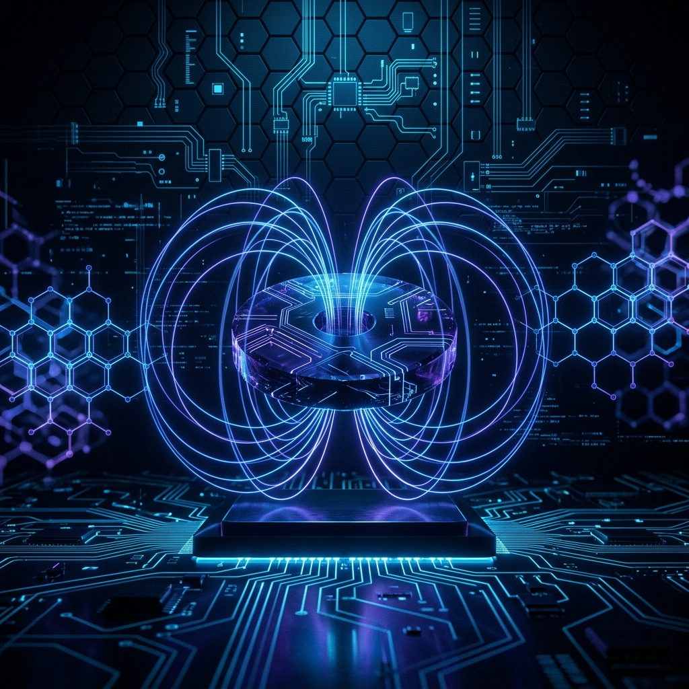

# 🧲 Süperiletken Ar-Ge ve Eğitim Portalı


<p align="center">
  
</p>

Bu depo, süperiletkenlik teorisini, bu makroskopik kuantum fenomeninin malzeme bilimi düzeyindeki analizlerini ve modern yüksek performanslı mühendislik ile kuantum bilgi işlem sistemlerine entegrasyonunu inceleyen açık kaynaklı bir **akademik literatür, Ar-Ge ve mimari araştırma portalıdır.**

Depodaki tüm içerikler, kavramsal modelleri, ileri düzey matematiksel/fiziksel denklemleri ve pratik donanım topolojilerini içermektedir.

---

## 📂 Dizin Mimarisi ve Eğitim/Ar-Ge Haritası

Portal, iki ana odak alanından oluşmaktadır: **Teorik Altyapı** ve **İleri Düzey Sistem ve Malzeme Araştırmaları**. Aşağıdaki haritadan detaylı teknik dokümanlara doğrudan erişebilirsiniz:

```text
Superiletken-ArGe-ve-Egitim/
│
├── 📚 egitim-modulleri/                  # Teorik Altyapı ve Kuantum Mekaniksel Temeller
│   ├── 📄 01-BCS-Teorisi-ve-Cooper-Ciftleri.md
│   └── 📄 02-Meissner-Etkisi-ve-Levitasyon.md
│
├── 🔬 arge/                              # Malzeme Bilimi ve İleri Sistem Mimarileri
│   ├── 🧪 malzeme-bilimi/
│   │   └── 📄 MgB2_ve_Turkiye_Bor_Potansiyeli.md
│   └── 🔌 sistem-mimarisi/
│       ├── 📄 Kayipsiz_Enerji_Sebeke_Topolojisi.md
│       └── 📄 Kuantum_Devreleri_Donanim_Mimarisi.md
│
└── 📄 README.md                          # Portal Ana Giriş Sayfası (Bu Dosya)
```

### 📘 1. Eğitim Modülleri (Teorik Temeller)
* **[Modül 01: BCS Teorisi ve Cooper Çiftleri](egitim-modulleri/01-BCS-Teorisi-ve-Cooper-Ciftleri.md):** 
  Elektron-fonon etkileşiminin Hamiltonian modeli, Cooper çiftlerinin kuantum singlet ($S=0$) durumu, BCS taban durum dalga fonksiyonu ($\Psi_{BCS}$) ve uyarılma spektrumundaki kuantum enerji boşluğu ($\Delta$) analizi. Ek olarak, **Pippard Lokal Olmayan Elektrodinamiği**, **Ginzburg-Landau (GL) Teorisi**, serbest enerji Taylor açınımı ve GL diferansiyel denklemlerinin analitik çözümü.
* **[Modül 02: Meissner Etkisi ve Manyetik Levitasyon](egitim-modulleri/02-Meissner-Etkisi-ve-Levitasyon.md):** 
  Kusursuz iletkenlik ile diyamanyetizma arasındaki farklar, London Denklemleri ve manyetik nüfuz derinliği ($\lambda_L$), Tip-I/Tip-II süperiletken ayrımı, kuantum akı çivilemesi (flux pinning) ve Maglev dinamikleri. Ek olarak, **Mıknatıslanma Giderim Faktörü ($D$)** ve geometrik arakesit analizleri ile **Abrikosov Girdap Kafesi (Vortex Lattice)** üçgen/kare geometri kararlılığı ve tekil girdap alan dağılımı ($B(r)$).

### 🔬 2. Ar-Ge Çalışmaları (Malzeme ve Sistem Tasarımları)
* **[Malzeme Bilimi: MgB2 ve Türkiye'nin Bor Potansiyeli](arge/malzeme-bilimi/MgB2_ve_Turkiye_Bor_Potansiyeli.md):** 
  Magnezyum Diborür'ün ($MgB_2$) hexagonal kristal yapısı ve anizotropisi, iki bantlı (two-band) süperiletkenlik modeli ($\sigma$ ve $\pi$ bantları için iki bantlı BCS denklemleri), Powder-in-Tube (PIT) tel ve kablo çekim teknolojisi ve Türkiye'nin dünya bor rezervlerindeki $\%73$'lük payına dayalı stratejik ileri teknoloji Ar-Ge yol haritası. Ek olarak, **Karbon Katkılama (Carbon Doping / CNT)** ile üst kritik alan ($H_{c2}$) artış mekanizmaları ve PIT tel üretim parametrelerini gösteren **Teknik Parametreler Referans Tablosu**.
* **[Sistem Mimarisi: Sıfır Kayıplı Kriyojenik Enerji Şebekeleri](arge/sistem-mimarisi/Kayipsiz_Enerji_Sebeke_Topolojisi.md):** 
  Yüksek Sıcaklık Süperiletken (HTS) kablo topolojileri, sıvı azot ($LN_2$) kriyojenik sirkülasyon döngüleri ve vakum kriyostat yalıtımının termodinamik analizi, alternatif akım (AC) histerezis/kuplaj kayıpları ile doğru akım (DC) iletim karşılaştırması, Quench dinamikleri, algılama algoritmaları ve bypass sönümleme devre şemaları. Ek olarak, **Süperiletken Transformatörler (HTS Sargılar)** mimarisi ve **SMES (Superconducting Magnetic Energy Storage)** manyetik enerji depolama ve akıllı şebeke stabilizasyon sistemleri.
* **[Donanım Mimarisi: Süperiletken Kuantum Devreleri ve RSFQ](arge/sistem-mimarisi/Kuantum_Devreleri_Donanim_Mimarisi.md):** 
  Josephson eklemi (S-I-S) fiziği, DC ve AC Josephson denklemleri, ultra hassas manyetik alan algılayıcı SQUID mimarisi, anharmonik osilatör olarak tasarlanan Transmon Qubit mimarisi ve kriyojenik CMOS (cryo-CMOS) hibrit kontrol arayüzleri. Ek olarak, yeni nesil ultra düşük güçlü süperiletken mantık ailelerinin gelişimi (**ERSFQ**, **eSFQ** ve zepto-joule güç tüketimli **AQFP** karşılaştırmaları), mantık aileleri karşılaştırma tablosu ve **Qubit Dekoherens Kaynakları (Kuazi-parçacık zehirlenmesi, dielektrik kayıplar, akı gürültüsü)** ile sönümleme çözümleri.

---

## 🌍 Küresel Süperiletken Ekosistemi: Ülkeler, Şirketler ve Projeler

Süperiletken teknolojileri, küresel jeopolitik arenada enerji bağımsızlığı, kuantum üstünlüğü ve geleceğin nükleer füzyon yarışında stratejik bir "enabler" (kilit kolaylaştırıcı) konumundadır. Bu alanda öne çıkan küresel aktörlerin, dev şirketlerin ve çığır açan mega projelerin kapsamlı analizi aşağıdadır:

### 1. Lider Ülkeler ve Stratejik Doktrinleri

*   **🇯🇵 Japonya (Pioner ve Ulaşım Lideri):** 
    Süperiletkenlik teknolojilerinde yarım asırlık bir liderliğe sahiptir. **RIKEN** (Gelişmiş Madde Bilimleri Merkezi) ve ulusal araştırma enstitüleri aracılığıyla temel fizik Ar-Ge'sini domine etmektedir. Japonya'nın ana stratejik doktrini, süperiletken manyetik levitasyon (SCMAGLEV) sistemleri ile yüksek hızlı demiryolu ulaşımında küresel standartları belirlemektir.
*   **🇺🇸 ABD (Kuantum ve Füzyon Girişimciliği):** 
    Devlet destekli **Enerji Bakanlığı (DOE)** laboratuvarları (Fermilab, Brookhaven, Argonne, Lawrence Berkeley) ve üniversiteler (MIT, Stanford, Berkeley) aracılığıyla yüksek enerji fiziği ve kuantum araştırmalarını fonlamaktadır. ABD doktrini, devlet fonlarının yanı sıra Silikon Vadisi merkezli milyar dolarlık özel sermaye yatırımları ile süperiletken füzyon reaktörleri ve kuantum bilgisayarlar inşa etmektir.
*   **🇨🇳 Çin (Devedik Altyapı ve Endüstriyel Ölçek):** 
    Süperiletken altyapı projelerini en hızlı ticari sahaya indiren ülkedir. Ulusal şebeke verimliliğini artırmak için büyük şehirlerde ticari HTS kablo koridorları kurmakta, nükleer füzyon alanında **EAST (Experimental Advanced Superconducting Tokamak)** ile plazma confinement rekorları kırmaktadır. Doktrini, hammadde ve üretim zincirini dikey entegrasyonla kontrol etmektir.
*   **🇪🇺 Avrupa Birliği (Almanya, İtalya, İsviçre - Büyük Ölçekli Bilim):** 
    İsviçre/Fransa sınırındaki **CERN** (Büyük Hadron Çarpıştırıcısı) projesi ile dünyanın en büyük düşük sıcaklık süperiletken (LTS NbTi/Nb3Sn) mıknatıs ağını yönetmektedir. Almanya (kriyojenik kablolar ve şebeke) ve İtalya (ASG Superconductors ile malzeme ve medikal mıknatıs üretimi) HTS endüstrisinde Avrupa'nın lokomotifleridir.

### 2. Dev Şirketler ve Öncü Girişimler (Startups)

Süperiletken endüstrisi, geleneksel kablo/manyet üreticileri ile yeni nesil "deep-tech" kuantum ve füzyon girişimlerinin (spin-off'lar) birleşiminden oluşmaktadır.

#### A. Güç Şebekeleri, Kablo ve Malzeme Üreticileri:
*   **Sumitomo Electric Industries (Japonya):** Dünyanın en kaliteli HTS (Bismut tabanlı BSCCO) tel ve kablolarını üreten köklü devlerden biridir. Manyetik levitasyon sistemlerine mıknatıs ve kablo sağlar.
*   **American Superconductor - AMSC (ABD):** Yüksek sıcaklık süperiletken (HTS) tel üretimi, askeri gemilerin manyetik imzasını sıfırlayan HTS degaussing (mıknatıslık giderme) sistemleri ve rüzgar türbini jeneratörleri üretir.
*   **Nexans (Fransa):** Küresel kablo devi. Şehir içi elektrik altyapılarını yenilemek için kriyojenik HTS kablo şebekeleri tasarımı ve kurulumunda liderdir.
*   **Fujikura & Furukawa Electric (Japonya):** 2. Nesil YBCO kaplı iletkenlerin (coated conductors) seri üretimini yapan küresel teknoloji şirketleridir.
*   **Shanghai Superconductor (Çin):** Yüksek akım kapasiteli 2G HTS şeritlerin ve manyetlerin seri üretiminde Çin'in endüstriyel üssüdür.

#### B. Çığır Açan Manyetik Füzyon Girişimleri (Startups):
*   **Commonwealth Fusion Systems - CFS (ABD):** MIT bünyesinden çıkan ve milyarlarca dolar yatırım alan şirket, YBCO HTS şeritler kullanarak dünyanın en güçlü manyetik alanına sahip nükleer füzyon mıknatıslarını üretmiştir. **SPARC** adlı kompakt tokamak reaktörünü inşa etmektedir.
*   **Tokamak Energy (İngiltere):** Küresel süperiletken füzyon yarışının bir diğer güçlü aktörüdür. Küresel HTS mıknatıs teknolojisini kullanarak yüksek sıcaklıklı kompakt küresel tokamaklar üretmektedir.

#### C. Süperiletken Kuantum Donanım Şirketleri:
*   **IBM Quantum (ABD):** 433 qubitlik *Osprey* ve 1121 qubitlik *Condor* işlemcileri ile süperiletken transmon qubit mimarisinin küresel öncüsüdür.
*   **Google Quantum AI (ABD):** *Sycamore* işlemcisi ile kuantum üstünlüğünü (quantum supremacy) dünyada ilk kez kanıtlayan ekiptir.
*   **Rigetti Computing (ABD):** Süperiletken kuantum çiplerini entegre devreler halinde üreten öncü halka açık girişimdir.
*   **IQM Quantum Computers (Finlandiya):** Avrupa'nın en büyük kuantum bilgisayar üreticisidir. Süperiletken qubit tabanlı QPU'lar geliştirir.
*   **Alice & Bob (Fransa):** Hata düzeltmeli (self-correcting) "Cat Qubit" mimarisi üzerinde çalışan ve kuantum hesaplamada devrim yaratmayı hedefleyen yenilikçi bir süperiletken startup'ıdır.

#### D. Medikal ve Bilimsel Ekipman Üreticileri:
*   **Bruker Corporation (ABD/Almanya):** Dünyanın en hassas NMR (Nükleer Manyetik Rezonans) spektrometrelerini ve süperiletken MRI mıknatıslarını üreten lider bilimsel cihaz şirketidir.
*   **ASG Superconductors (İtalya):** Medikal cihazlar, proton terapisi mıknatısları ve MgB2 tabanlı helyumsuz (cryogen-free) açık MRI mıknatısları geliştiren lider üreticidir.

### 3. Dünyayı Değiştiren Süperiletken Mega-Projeleri

*   **⚡ Münih AmpaCity Projesi (Almanya):** 
    Münih şehir merkezinde Nexans tarafından kurulan **1 kilometrelik HTS üç fazlı koaksiyel kablo**, $10\text{ kV}$ gerilim altında $40\text{ MVA}$ güç taşımaktadır. Klasik kabloların aksine sıfır ısı sızıntısı ve sıfır kayıpla çalışan bu proje, kentsel altyapı entegrasyonunda süperiletkenliğin rüştünü ispat ettiği dönüm noktasıdır.
*   **🔌 Şanghay Ticari HTS Güç Kablosu (Çin):** 
    Şanghay şehir merkezinin en yoğun iş bölgesinde döşenen **1.2 kilometrelik, 35 kV'luk ticari HTS kablo hattı**, dünyanın yoğun kentsel alanlarında kesintisiz enerji sağlayan ilk ve en uzun ticari HTS şebeke hatlarından biridir.
*   **🚄 Yamanashi L0 SCMAGLEV Manyetik Levitasyon Hattı (Japonya):** 
    JR Central tarafından geliştirilen ve sıvı helyumla soğutulan LTS NbTi süperiletken elektromıknatıslar kullanan maglev treni, **$603\text{ km/sa}$ hız rekoruyla** dünyanın en hızlı raylı kara taşıtı unvanına sahiptir. Tokyo-Nagoya arasını 40 dakikaya indirecektir.
*   **⚛️ CFS & MIT 20 Tesla HTS Mıknatıs Testi (ABD):** 
    2021 yılında Commonwealth Fusion Systems ve MIT, YBCO HTS şeritler kullanarak el büyüklüğündeki sargılardan **$20\text{ Tesla}$** gücünde sabit bir manyetik alan üretmeyi başardı. Bu başarı, nükleer füzyon reaktörlerinin boyutunu 40 kat küçültmeyi sağlayarak temiz enerji çağını başlatan en kritik fizik eşiğidir.
*   **🔬 CERN Büyük Hadron Çarpıştırıcısı - LHC (İsviçre/Fransa):** 
    Yer altındaki $27\text{ kilometrelik}$ halka boyunca proton demetlerini bükmek için **1232 adet süperiletken dipol mıknatıs** ($8.33\text{ Tesla}$ gücünde) kullanır. Bu sistem, sıvı helyumla $1.9\text{ Kelvin}$ sıcaklığa soğutulur ve uzay boşluğundan bile daha soğuk olan dünyanın en büyük kriyojenik makinesidir.

---

## 📊 Süperiletken Malzeme Karşılaştırma Tablosu

Aşağıdaki tablo, endüstriyel Ar-Ge çalışmalarında en sık kullanılan süperiletken malzemelerin kritik fiziksel ve teknik parametrelerini özetlemektedir:

| Malzeme Sınıfı | Kimyasal Formül | Kritik Sıcaklık ($T_c$) | Üst Kritik Manyetik Alan ($H_{c2}$) | Temel Soğutma Akışkanı | En Sık Kullanıldığı Alanlar |
| :--- | :--- | :--- | :--- | :--- | :--- |
| **Düşük Sıcaklık (LTS)** | $NbTi$ | $9.2\text{ K}$ | $\sim 14.5\text{ Tesla}$ | Sıvı Helyum ($4.2\text{ K}$) | Medikal MRI, Parçacık Hızlandırıcılar (LHC) |
| **Düşük Sıcaklık (LTS)** | $Nb_3Sn$ | $18.3\text{ K}$ | $\sim 30\text{ Tesla}$ | Sıvı Helyum ($4.2\text{ K}$) | Yüksek Alan Mıknatısları, ITER Füzyon Reaktörü |
| **Ara Sıcaklık (MTS)** | $MgB_2$ | **$39\text{ K}$** | $\sim 15 - 20\text{ Tesla}$ (Doping ile $40+\text{ T}$) | Sıvı Neon ($27\text{ K}$) veya Cryocooler | Güç Kabloları, Kompakt MRI, Maglev Trenleri |
| **Yüksek Sıcaklık (HTS)**| $YBa_2Cu_3O_{7-x}$ (YBCO) | $93\text{ K}$ | $> 100\text{ Tesla}$ | Sıvı Nitrojen ($77\text{ K}$) | Kompakt Tokamaklar, Yüksek Kapasiteli Şehir Kabloları |

---

## 🎯 Araştırma ve Geliştirme Hedefleri

1. **Akademik Kaynak Oluşturma:** Süperiletkenlik alanında Türkçe hazırlanmış en kapsamlı, matematiksel derinliğe sahip açık kaynaklı eğitim setini sunmak.
2. **Kriyojenik Güç Sistemleri:** Fosil yakıtlardan yenilenebilir enerjiye geçiş sürecinde, akıllı şehirlerin ihtiyaç duyduğu sıfır kayıplı yeraltı iletim hatları için uygulanabilir HTS kablo, transformatör ve SMES mimarileri sunmak.
3. **Kuantum Donanım Entegrasyonu:** Geleceğin süper-bilgisayar ve kuantum bilgisayar tasarımlarında, oda sıcaklığındaki dijital elektroniğin kriyojenik ortamdaki qubitlerle haberleşmesini sağlayan RSFQ, AQFP ve cryo-CMOS hibrit donanım katmanlarını analiz etmek.
4. **Milli Teknoloji Hamlesi:** Türkiye'nin zengin bor kaynaklarını yüksek teknoloji donanım üretiminde ($MgB_2$ süperiletken teller, havacılık motorları, raylı sistemler) katma değerli bir unsura dönüştürecek vizyonel bir yol haritası sunmak.

---

## 📜 Lisans

Bu proje **MIT Lisansı** altında lisanslanmıştır. Detaylar için lisans dosyalarını inceleyebilirsiniz.