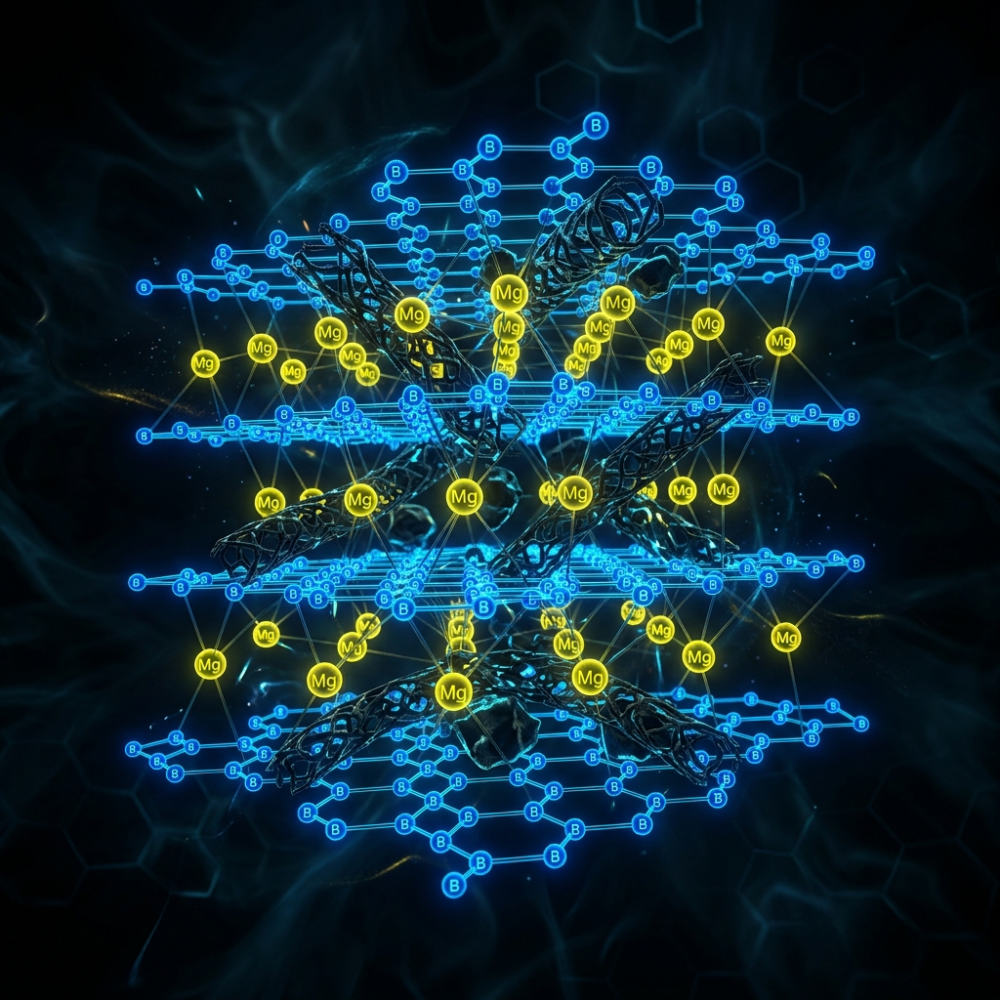

# İleri Malzeme Analizi: Magnezyum Diborür (MgB2) ve Bor Teknolojileri

<p align="center">
  
</p>

2001 yılında Jun Akimitsu ve ekibi tarafından $39\text{ K}$ sıcaklıkta süperiletkenlik gösterdiği keşfedilen **Magnezyum Diborür ($MgB_2$)**, malzeme bilimi ve süperiletken şebeke topolojilerinde devrim yaratmıştır. Geleneksel metalik BCS süperiletkenleri (örneğin $NbTi$, $Nb_3Sn$) sıvı helyum ($4.2\text{ K}$) ile soğutulmaya ihtiyaç duyarken, $MgB_2$'nin $39\text{ K}$ olan kritik sıcaklığı, kapalı döngü kriyojenik soğutucularla (cryocoolers) veya sıvı neon ($27\text{ K}$) / sıvı hidrojen ($20\text{ K}$) kullanılarak kolayca aşılabilmektedir.

Bu çalışmada, $MgB_2$'nin kristalografik yapısı, iki bantlı (two-band) kuantum mekaniksel davranış modelleri, **Karbon/Kimyasal Katkılama (Doping) Mekanizmaları**, endüstriyel tel/kablo üretim teknolojileri (**PIT Parametreleri Tablosu**) ve Türkiye'nin stratejik bor rezervlerine dayalı yerli Ar-Ge yol haritası akademik düzeyde incelenmektedir.

---

## 1. Kristalografik Yapı ve Anizotropi

$MgB_2$, $AlB_2$ tipi altıgen (hexagonal) kristal yapısına ($P6/mmm$ uzay grubu) sahiptir. Kristal yapısı, iki boyutlu petek (graphite-like honeycomb) Bor katmanları ile bu katmanların arasına yerleşmiş üçgen Magnezyum katmanlarının ardışık diziliminden oluşur.

```
       Magnezyum Diborür (MgB2) Hexagonal Kristal Kafesi
       
          Mg İyonları Katmanı           Bor İyonları Katmanı (Petek)
          
             (Mg)     (Mg)                  (B)───────(B)
                                           / \       / \
                                          /   \     /   \
                 (Mg)                   (B)───(B)─(B)───(B)
                                          \   /     \   /
                                           \ /       \ /
             (Mg)     (Mg)                  (B)───────(B)
```

### Kafes Parametreleri:
- **a-ekseni sabiti:** $a = 0.3086\text{ nm}$ (Bor katmanı içindeki B-B bağ mesafesi)
- **c-ekseni sabiti:** $c = 0.3524\text{ nm}$ (Katmanlar arası mesafe)
- **Anizotropi Oranı ($\gamma$):** Kristal kafesin yön bağımlılığı, üst kritik alan parametrelerinde kendini gösterir:
  
  $$\gamma = \frac{H_{c2}^{||ab}}{H_{c2}^{||c}} \approx 1.5 - 2.5$$

Bor katmanları içindeki güçlü kovalent $sp^2$ melezleşmesi bağları ve katmanlar arasındaki nispeten zayıf metalik-iyonik bağlar, malzemenin elektriksel ve manyetik özelliklerinin yön bağımlı (anizotropik) olmasını belirler.

---

## 2. İki Bantlı (Two-Band) Süperiletkenlik Teorisi

$MgB_2$'yi diğer tüm geleneksel süperiletkenlerden ayıran en radikal fiziksel özellik, **iki farklı Fermi yüzeyine ve iki farklı enerji boşluğuna ($\Delta$)** sahip olmasıdır. Bu olgu, ilk kez 1959'da Suhl, Matthias ve Walker tarafından teorize edilmiş, ancak ilk somut örneği $MgB_2$ ile deneysel olarak doğrulanmıştır.

```
                  İki Bantlı Enerji Boşluğu (Energy Gap) Modeli
                  
               σ-Bant (Güçlü Kuplaj)               π-Bant (Zayıf Kuplaj)
                   Δ_σ(0) ≈ 7.2 meV                    Δ_π(0) ≈ 2.3 meV
               ┌──────────────────────┐            ┌──────────────────────┐
               │    2D Bor Katmanı    │            │  3D Katmanlar Arası  │
               │   Güçlü Fonon Bağı   │            │   Zayıf Fonon Bağı   │
               └──────────────────────┘            └──────────────────────┘
```

### Bant Karakteristikleri:
1. **$\sigma$-Bandı (Güçlü Kuplaj):** İki boyutlu Bor katmanlarındaki bağlardan ($p_{x,y}$ orbitalleri) kaynaklanır. Kristal kafesin düzlem içi optik fonon modlarıyla ($E_{2g}$ modu) aşırı güçlü bir şekilde etkileşime girer. Sıfır Kelvin'deki enerji boşluğu oldukça büyüktür: $\Delta_\sigma(0) \approx 7.2\text{ meV}$.
2. **$\pi$-Bandı (Zayıf Kuplaj):** Bor atomlarının düzlem dışı $p_z$ orbitallerinden kaynaklanan üç boyutlu Fermi yüzeyidir. Fonon etkileşimi zayıftır. Sıfır Kelvin'deki enerji boşluğu küçüktür: $\Delta_\pi(0) \approx 2.3\text{ meV}$.

### İki Bantlı BCS Gap Denklemleri:
Süperiletkenliği başlatan bu iki bant, birbirleriyle Josephson tipi bir kuantum eşleşme terimi ($V_{\sigma\pi}$) ile etkileşir. Sistem, iki adet kendiyle uyumlu integral denkleminin ortak çözümüyle tanımlanır:

$$\Delta_i = \sum_{j=\sigma,\pi} N_j(0) V_{ij} \int_{0}^{\hbar\omega_D} \frac{\Delta_j}{\sqrt{\varepsilon^2 + \Delta_j^2}} \tanh\left(\frac{\sqrt{\varepsilon^2 + \Delta_j^2}}{2k_B T}\right) d\varepsilon$$

Burada $V_{ij}$ etkileşim matrisidir:

$$V = \begin{pmatrix} V_{\sigma\sigma} & V_{\sigma\pi} \\ V_{\pi\sigma} & V_{\pi\pi} \end{pmatrix}$$

---

## 3. Karbon Katkılama (Carbon Doping) ve Üst Kritik Alan ($H_{c2}$) Artışı

Katkılanmamış saf $MgB_2$'nin en büyük dezavantajı, üst kritik manyetik alanının ($H_{c2}$) nispeten düşük olmasıdır (4.2 K sıcaklıkta $H_{c2} \approx 15-18\text{ Tesla}$). Bu değer, ITER gibi füzyon reaktörlerinde veya yüksek alanlı mıknatıslarda kullanımını sınırlar.

### Karbon Katkılama Mekanizması:
Bor (B) atomlarının bir kısmının yerine Karbon (C) atomlarının ikame edilmesi (substitution), $MgB_2$ kristal kafesinde kontrollü bir yapısal düzensizlik (disorder) oluşturur.
- **İkame Formülü:** $Mg(B_{1-x}C_x)_2$ (Tipik olarak optimal oran $x \approx 0.05 - 0.08$ arasıdır).
- **Fiziksel Etki:** Karbon atomunun eklenmesi, Bor petek katmanları içindeki serbest elektron saçılmasını (scattering) dramatik şekilde artırır. Bu durum, süperiletken koherens boyunu ($\xi$) kısaltır.
- **Üst Kritik Alan Değişimi:** Üst kritik manyetik alan, koherens boyunun karesiyle ters orantılıdır:
  
  $$H_{c2}(0) = \frac{\Phi_0}{2\pi\xi^2}$$
  
  Koherens boyunun ($\xi$) düzensizlik nedeniyle kısalması, $H_{c2}$ değerini **$15\text{ Tesla}$ seviyesinden $40+\text{ Tesla}$ seviyesine** fırlatır! Bu artış sırasında kritik sıcaklıkta ($T_c$) hafif bir düşüş yaşansa da ($39\text{ K}$'den $\sim 30-35\text{ K}$'e), yüksek manyetik alan performansı bu kaybı fazlasıyla telafi eder.
- **Katkılama Kaynakları:** Karbon katkılaması için saf amorf karbonun yanı sıra **Karbon Nanotüpler (CNT)**, silisyum karbür ($SiC$), malik asit ($C_4H_6O_5$) veya grafen gibi organik bileşikler de sinterleme aşamasında reaktant olarak kullanılır.

---

## 4. Endüstriyel Üretim: PIT (Powder-in-Tube) Metodu

$MgB_2$, seramik tabanlı HTS malzemelere kıyasla çok daha yüksek mekanik işlenebilirliğe sahiptir. Endüstriyel ölçekte tel üretmek için **PIT (Powder-in-Tube)** yöntemi uygulanır.

### PIT Üretim Aşamaları ve Teknik Parametreler:

Aşağıdaki tablo, endüstriyel $MgB_2$ tel üretimi esnasında uygulanan kritik metalurjik ve mekanik parametreleri özetlemektedir:

| Parametre | In-Situ Yöntemi | Ex-Situ Yöntemi | Açıklama / Teknik Detay |
| :--- | :--- | :--- | :--- |
| **Başlangıç Tozları** | Saf $Mg$ (toz/talaş) + $amorf\ B$ | Önceden sentezlenmiş $MgB_2$ | In-Situ yönteminde reaksiyon borunun içinde gerçekleşir. |
| **Sinterleme Sıcaklığı** | $650^\circ\text{C} - 750^\circ\text{C}$ | $900^\circ\text{C} - 1000^\circ\text{C}$ | Ex-situ daha yüksek sıcaklık ve uzun sinterleme süresi gerektirir. |
| **Bariyer Katmanı** | Demir ($Fe$), Niyobiyum ($Nb$), Tantal ($Ta$) | Paslanmaz Çelik, Nikel Alaşımları | $Mg$ ile dış bakır kılıf arasındaki difüzyonu ve faz reaksiyonunu önler. |
| **Dış Koruyucu Kılıf** | Monel (Ni-Cu alaşımı) veya Bakır ($Cu$) | Monel, Paslanmaz Çelik | Kabloya mekanik mukavemet ve kriyojenik kararlılık (stabilizasyon) sağlar. |
| **Mekanik Çekme Oranı** | $\%15 - \%20$ (pas başına) | $\%10 - \%15$ (pas başına) | Tel çapını mikron seviyesine düşürmek için uygulanan soğuk çekme oranı. |
| **Kritik Akım Yoğunluğu ($J_c$)**| $\sim 10^5\text{ A/cm}^2$ ($20\text{ K}$, $2\text{ T}$) | $\sim 10^4\text{ A/cm}^2$ ($20\text{ K}$, $2\text{ T}$) | In-situ yönteminde tanecikler arası bağlantı (connectivity) çok daha iyidir. |

---

## 5. Stratejik Jeopolitik Analiz: Türkiye Bor Rezervleri

Magnezyum Diborür teknolojisinin stratejik değeri, bileşenlerinden biri olan **Bor (B)** elementinden kaynaklanmaktadır. Türkiye, dünya genelindeki bor rezervlerinin yaklaşık **%73'üne** sahiptir (Kırka, Emet, Bigadiç ve Kestelek yatakları).

```
                      Dünya Bor Rezerv Dağılımı (%)
                      
       Türkiye ───────────────────────────────────────────► 73.0%
       ABD     ───────────► 6.2%
       Rusya   ────────► 4.5%
       Diğer   ─────────────► 16.3%
```

### Hammaddeden İleri Teknoloji Ekosistemine Geçiş Yol Haritası:
Mevcut durumda Türkiye, ham bor cevherini veya sodyum borat gibi düşük katma değerli kimyasalları ihraç etmektedir. $MgB_2$ süperiletken teknolojisi, Türkiye için kritik bir **teknolojik sıçrama tahtası (leapfrogging)** sunmaktadır:

1. **İleri Metalurjik Bor Üretimi:**
   Süperiletken $MgB_2$ üretimi için sıradan bor kimyasalları kullanılamaz. Son derece saf ($\%99.9+$) ve alt-mikron boyutlu **amorf bor** veya **bor karbür** üretimi için ulusal tesislerin kurulması elzemdir.
2. **Kriyojenik ve Güç Sistemleri Ar-Ge Laboratuvarı:**
   Bor rezervlerinin yakınında $MgB_2$ tel çekme, çok damarlı (multi-filament) kablolama ve vakum kriyostat üretimi yapan yerli merkezler kurulmalıdır.
3. **Milli Güç Kablosu Entegrasyonu:**
   TEİAŞ ve EPDK iş birliği ile, büyük şehirlerin (örneğin İstanbul Boğazı geçiş hatları) yüksek kapasiteli elektrik iletim altyapıları yerli $MgB_2$ kablo projeleriyle modernize edilmelidir.
4. **Savunma Sanayii ve Uzay Uygulamaları:**
   $MgB_2$ kablolar hafif, kompakt ve yüksek manyetik alan dayanımlı elektromıknatıs yapımına imkan tanır. Yerli uyduların kriyojenik güç dağıtım şebekelerinde, elektromanyetik fırlatıcılarda (Railgun) ve askeri gemilerin sessiz süperiletken motor projelerinde yerli bor tabanlı süperiletkenlerin kullanılması tam bağımsızlık doktrininin bir parçası olmalıdır.

---

## Referanslar ve İleri Okuma
1. Akimitsu, J. (2001). "Superconductivity in MgB2". *Nature*, 410, 63-64.
2. Dou, S. X., et al. (2002). "Enhancement of the critical current density and flux pinning of MgB2 superconductor by nanoparticle SiC doping". *Applied Physics Letters*, 81(18), 3419-3421.
3. Flükiger, R., et al. (2006). "Superconducting properties of MgB2 single and multifilamentary wires". *Physica C: Superconductivity*, 445, 332-337.
4. Buzea, C., & Yamashita, T. (2001). "Review of the superconducting properties of MgB2". *Superconductor Science and Technology*, 14(11), R115.
