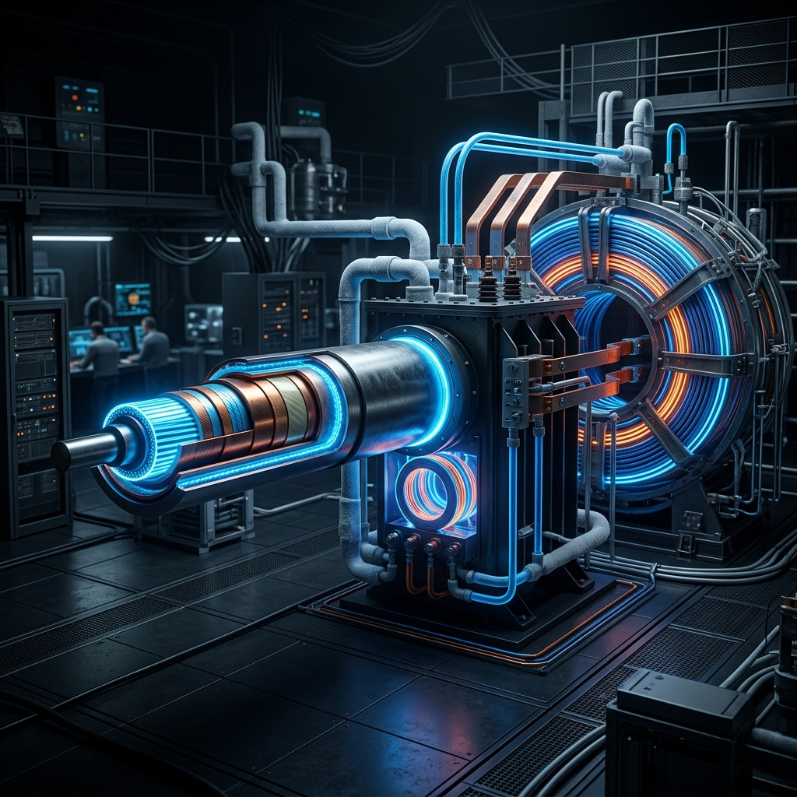

# Sistem Mimarisi: Sıfır Kayıplı Kriyojenik Enerji Şebekeleri

<p align="center">
  
</p>

Mevcut elektrik iletim altyapıları, geleneksel yüksek voltajlı bakır veya alüminyum hava hatlarına (overhead lines) dayanmaktadır. Bu hatlarda üretilen elektriğin yaklaşık $\%5$ ila $\%10$'u Joule ısınması ($I^2 R$) nedeniyle doğrudan atmosfere ısı olarak kaybedilmektedir. Yoğun nüfuslu metropollerde yüksek gerilim hatlarının yer altına alınması, yalıtım ve alan darlığı sebebiyle klasik kablolarla aşırı maliyetli ve verimsizdir.

**Yüksek Sıcaklık Süperiletken (HTS - High-Temperature Superconducting)** kablo, **Süperiletken Transformatör** ve **SMES (Superconducting Magnetic Energy Storage)** mimarileri, geleneksel sistemlerle aynı fiziksel kesit alanında **10 kata kadar daha fazla akım** taşıyabilme, sıfır Joule iletim kaybı ve milisaniye hızında aktif güç stabilizasyonu sağlama kabiliyetine sahiptir. Bu çalışmada, sıfır kayıplı kriyojenik enerji iletim ve depolama şebekelerinin elektromekanik, termodinamik, koruma ve güvenlik mimarileri incelenmektedir.

---

## 1. HTS Kablo Tasarımları ve Topolojileri

Süperiletken kablolar, tek fazlı koaksiyel yapılardan üç fazlı triaksiyel yapılara kadar farklı elektromanyetik koruma ve kriyojenik akışkan gereksinimlerine göre tasarlanır.

```
                  HTS Koaksiyel Kablo Kesit Görünümü
                  
                   ┌─────────────────────────────────┐ Outer Cryostat Jacket
                   │   ┌─────────────────────────┐   │ Vacuum Insulation Barrier
                   │   │   ┌─────────────────┐   │   │ Liquid Nitrogen (LN2) Return
                   │   │   │   ┌─────────┐   │   │   │ HTS Shield Layer
                   │   │   │   │   ┌─*─┐ │   │   │   │ HTS Phase Conductor
                   │   │   │   │   │ 🌀 ││   │   │   │ Central Former (LN2 Flow)
                   │   │   │   │   └───┘ │   │   │   │
                   │   │   │   └─────────┘   │   │   │
                   │   │   └─────────────────┘   │   │
                   │   └─────────────────────────┘   │
                   └─────────────────────────────────┘
```

### Yapısal Katmanlar:
1. **Merkezi Taşıyıcı (Former):** Esnek paslanmaz çelik spiral boru. Hem mekanik destek sağlar hem de içinden basınçlı soğutucu akışkan (sıvı azot - $LN_2$) akar.
2. **HTS Faz İletkeni:** Former üzerine sarmal (helical) olarak sarılmış süperiletken şeritler (örneğin $MgB_2$ veya $YBCO$ bantlar).
3. **Kriyojenik Dielektrik:** Düşük sıcaklıklarda yüksek gerilim yalıtımını koruyan özel kağıt-plastik laminat (PPLP) katmanı.
4. **Süperiletken Kalkan (Shield):** Dışarıya kaçabilecek kaçak akıları önlemek ve manyetik alanı içeride hapsetmek için zıt sarmal sarılmış HTS şeritler.
5. **Vakumlu Kriyostat Kılıfı:** Çift cidarlı, aralarında yüksek vakum ($10^{-5}\text{ mbar}$) ve yansıtıcı çok katmanlı yalıtım (MLI - Multi-Layer Insulation) bulunan esnek boru. Radyasyonla gelen ısı sızıntılarını önler.

---

## 2. Kriyojenik Soğutma Döngüleri ve Termodinamik Analiz

Kabloların süperiletken fazda kalması için sürekli olarak soğutulması gerekir. En yaygın kriyojenik akışkan, $77\text{ K}$ kaynama noktasına sahip olan son derece ucuz ve güvenli olan **Sıvı Azottur ($LN_2$)**.

### Termodinamik Isı Yükü ($Q_{total}$):
Kriyojenik şebekenin verimliliği, birim metre başına düşen ısı sızıntısı ($Q_{total}$) ile belirlenir:

$$Q_{total} = Q_{rad} + Q_{cond} + Q_{AC} \quad (\text{W/m})$$

* **Radyasyon Isı Sızıntısı ($Q_{rad}$):** Çevre sıcaklığından ($300\text{ K}$) kriyojenik hatta ($77\text{ K}$) ışıma yoluyla geçen ısıdır:
  
  $$Q_{rad} = \sigma \epsilon_{eff} A (T_{out}^4 - T_{in}^4)$$
  
  ($\sigma$: Stefan-Boltzmann sabiti, $\epsilon_{eff}$: Çok katmanlı yalıtımın efektif yayma gücü).
* **Kondüksiyon Isı Sızıntısı ($Q_{cond}$):** Kablo destek aparatları ve uç bağlantı noktalarından (current leads) iletim yoluyla gelen ısıdır.
* **AC Akım Kayıpları ($Q_{AC}$):** Alternatif akımda oluşan elektromanyetik kayıplardır.

---

## 3. AC vs. DC Güç İletimi ve Kayıp Analizi

Süperiletkenler, **Doğru Akımda (DC)** sıfır elektriksel dirence sahiptir ve hiçbir Joule kaybı ($I^2 R = 0$) oluşturmazlar. Ancak **Alternatif Akımda (AC)**, süperiletkenin içindeki akı çizgilerinin sürekli hareket etmesi nedeniyle ısı açığa çıkar.

### AC Kayıp Mekizmaları:
1. **Histerezis Kayıpları ($P_{hyst}$):** Akım yön değiştirdikçe Abrikosov girdaplarının çivilenme noktalarından kopup tekrar bağlanması esnasında oluşan kayıplardır (Bean modeli ile hesaplanır):
   
   $$P_{hyst} \propto f \frac{J^3}{J_c}$$
   
   ($f$: Frekans, $J$: Çalışma akım yoğunluğu, $J_c$: Kritik akım yoğunluğu).
2. **Kuplaj Kayıpları (Coupling Losses):** Çok damarlı (multi-filament) HTS şeritlerde, damarlar arasındaki normal metalik matris içinden geçen AC akımların oluşturduğu girdap akımı kayıplarıdır.

---

## 4. Süperiletken Transformatörler (Superconducting Transformers)

Geleneksel transformatörler (trafo), bakır sargılar ve ferromanyetik çelik çekirdek kullanır. Büyük trafolarda bakır sargılardaki Joule ısı kayıpları çok yüksektir ve soğutma için yanıcı mineral yağlar kullanılır.

```
                  Süperiletken Transformatör Kesit Görünümü
                  
                   ┌───────────────────────────────────┐ Vakumlu Dış Tank
                   │    ┌─────────────────────────┐    │
                   │    │    Sıvı Azot (LN2)      │    │
                   │    │  ┌───────────────────┐  │    │
                   │    │  │    HTS Sargılar   │  │    │ (MgB2 veya YBCO)
                   │    │  └───────────────────┘  │    │
                   │    └─────────────────────────┘    │
                   │           [ Demir Çekirdek ]      │ (Oda Sıcaklığında)
                   └───────────────────────────────────┘
```

### Mimari Özellikler:
1. **HTS Sargılar (HTS Windings):** Transformatörün birincil (primer) ve ikincil (sekonder) sargıları $MgB_2$ veya YBCO süperiletken şeritlerden üretilir. Kriyojenik sıvı azot tankı (cryostat) içerisine yerleştirilirler.
2. **Demir Çekirdek (Magnetic Core):** Transformatörün manyetik akıyı ileten demir çekirdeği oda sıcaklığında tutulur. Böylece çekirdekte oluşan histerezis ve girdap akımı kayıpları, kriyojenik sisteme ekstra ısı yükü getirmez. Kriyostat, çekirdeğin içinden geçecek şekilde tasarlanır.
3. **Mühendislik Avantajları:**
   - **Maksimum Verimlilik:** Sargı kayıpları tamamen ortadan kalktığı için trafo verimliliği $\%99.8+$ seviyesine çıkar.
   - **Dehşet Verici Ağırlık Azalması:** HTS sargıların akım taşıma kapasitesi çok yüksek olduğu için bakıra kıyasla sargı hacmi ve ağırlığı **$\%50$ oranında azalır.**
   - **Yangın ve Çevre Güvenliği:** Yanıcı ve toksik mineral trafo yağları yerine çevre dostu sıvı azot kullanılır. Trafo patlaması ve yangın riski sıfıra iner.

---

## 5. SMES (Süperiletken Manyetik Enerji Depolama) Sistemleri

**SMES (Superconducting Magnetic Energy Storage)**, enerjiyi süperiletken bir elektromıknatısın (bobin) içinde oluşturulan manyetik alanda, herhangi bir kimyasal dönüşüm olmadan doğrudan elektriksel olarak depolayan bir sistemdir.

```
                           SMES Sistem Mimarisi
                           
      [ Şebeke (AC) ] ◄──► [ Güç Dönüştürücü (PCS) ] ◄──► [ HTS Bobin (SMES) ]
                                (AC/DC - DC/AC)             E = 1/2 L I^2
                                                                  ▲
                                                          [ Kriyojenik Soğutma ]
```

### Matematiksel Modelleme:
İndüktansı $L$ olan süperiletken bir bobinden geçen akım $I$ olduğunda depolanan toplam manyetik enerji ($E$):

$$E = \frac{1}{2} L I^2 \quad (\text{Joule})$$

Bobin süperiletken olduğu için, elektrik akımı bobin içinde herhangi bir dirençle karşılaşmadan sonsuza dek dönebilir ve enerji kaybı yaşanmaz.

### SMES Donanım Bileşenleri:
1. **Süperiletken Bobin:** Çok yüksek manyetik alanlara ve mekanik gerilmelere dayanıklı solenoid veya toroidal yapıda HTS bobin.
2. **Güç Koşullandırma Sistemi (PCS - Power Conditioning System):** Enerjinin şebekeye şarj edilmesini ve şebekeden deşarj edilmesini kontrol eden ultra hızlı güç elektroniği (IGBT tabanlı çift yönlü dönüştürücüler).
3. **Kriyostat:** Bobini $20\text{ K} - 77\text{ K}$ arasında tutan termal izolasyonlu kriyojenik tank.

### Akıllı Şebeke Stabilizasyonu:
- **Milisaniye Hızında Tepki:** SMES, pillerin aksine kimyasal bir reaksiyona ihtiyaç duymaz. Enerji doğrudan elektronların kinetik enerjisi ve manyetik alan olarak depolandığı için şebekedeki dalgalanmalara **milisaniyeden daha kısa sürede ($<1\text{ ms}$)** yanıt verebilir.
- **Dehşet Verici Çevrim Verimliliği:** Şarj-deşarj çevrim verimliliği **$\%95+$** civarındadır.
- **Şebeke Kararlılığı:** Özellikle rüzgar ve güneş gibi kesintili yenilenebilir enerji kaynaklarının şebekeye entegrasyonunda frekans ve voltaj stabilizasyonu sağlamak amacıyla "süper-kapasitör" olarak görev yapar.

---

## 6. Güvenlik ve Koruma Mimarisi: Quench Dinamikleri

Süperiletken şebeke işletimindeki en kritik güvenlik riski **Quench** olgusudur.

> [!WARNING]
> **Quench Nedir?**
> Kablonun herhangi bir noktasında yerel akımın $I_c$ limitini aşması veya kriyojenik arıza nedeniyle sıcaklığın $T_c$ üzerine fırlaması durumunda süperiletkenlik lokal olarak aniden kaybolur. Malzeme o noktada hızla normal dirençli duruma geçer.

Normal duruma geçen bölgede akım akmaya devam ederse, devasa bir Joule ısınması başlar. Bu lokal ısı hızla çevreye yayılarak kabloyu eritebilir.

### Koruma Devre Şeması:
Süperiletken kabloyu veya bobini korumak için, sisteme paralel bağlı hızlı yarı iletken tristörler (SCR) ve enerjiyi absorbe edecek harici bir deşarj direnci ($R_d$) kullanılır.

```
       (+) ───┬─────────────────── [ HTS Kablo / Bobin ] ───────────┬─── (-)
              │                                                     │
              ├───►| [ Tristör Koruması (Bypass) ] ◄────────────────┤
              │                                                     │
              └─────────────── [ Deşarj Direnci R_d ] ──────────────┘
```

### Quench Algılama Algoritması:
Süperiletken boyunca yerleştirilmiş gerilim algılama kabloları sürekli olarak gerilim farkını ($\Delta V$) izler. Eğer $\Delta V \ge 100\text{ mV}$ eşiğini aşarsa ve bu durum $10\text{ ms}$ boyunca devam ederse:
1. Ana şebeke kesicileri devreyi açar.
2. Koruma tristörleri aktif edilerek akım süperiletken yoldan çekilir ve dış bypass hattına aktarılır.
3. HTS kablosunda veya bobininde biriken elektromanyetik enerji $R_d$ direnci üzerinden saniyeler içinde ısıya dönüştürülerek sistem güvenle kapatılır.

---

## Referanslar ve İleri Okuma
1. Hazelton, D., et al. (2009). "First-of-a-kind HTS cable systems". *IEEE Transactions on Applied Superconductivity*, 19(3), 1718-1721.
2. Noe, M., & Steurer, M. (2007). "High-temperature superconductor fault current limiters". *Superconductor Science and Technology*, 20(3), R15.
3. Chen, J., et al. (2015). "Design and application of superconducting magnetic energy storage". *IEEE Transactions on Smart Grid*, 6(4), 1834-1840.
4. Schwenterly, S. W., et al. (1999). "Design and testing of high-temperature superconducting transformers". *IEEE Transactions on Applied Superconductivity*, 9(2), 680-683.
