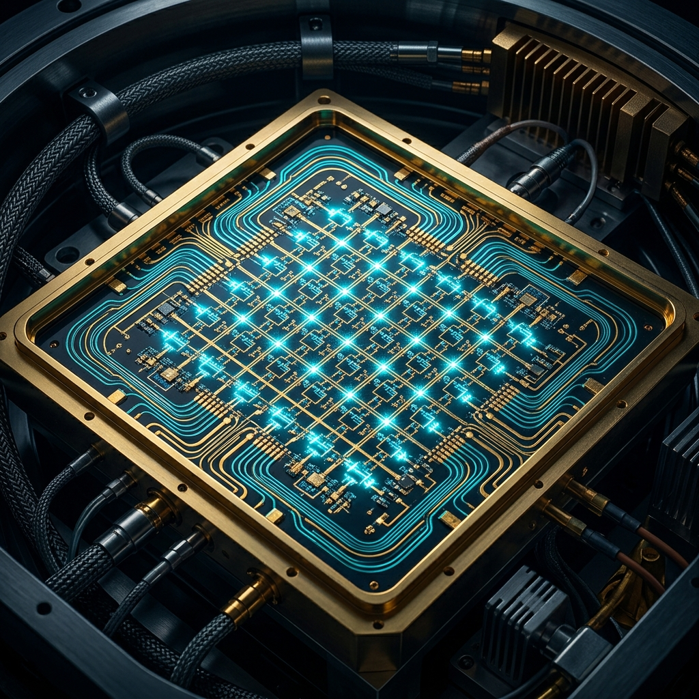

# Donanım Mimarisi: Süperiletken Kuantum Devreleri ve RSFQ Mantığı

<p align="center">
  
</p>

Geleneksel yarı iletken mikroişlemciler (klasik silikon transistörler), fiziksel küçülme sınırlarına (karanlık silikon - dark silicon ve kuantum tünelleme limitleri) ulaşmıştır. Klasik transistör tabanlı sistemler yüksek frekanslarda ($>5\text{ GHz}$) devasa ısı üreterek termal tıkanmaya neden olurlar. Süperiletken donanım mimarileri ise Josephson eklemleri kullanarak **sıfır Joule ısı kaybıyla** çalışan, **$100\text{ GHz}$ ile $750\text{ GHz}$** frekans aralığında işlem yapabilen dijital mantık aileleri ve kuantum işlemciler (QPU) geliştirmemize imkan tanır.

Bu çalışmada, Josephson eklemlerinin kuantum mekaniği, SQUID manyetometreleri, **SFQ Kuantum Mantık Ailelerinin Gelişimi (RSFQ, ERSFQ, AQFP)**, süperiletken kuantum bilgisayar donanım mimarileri (Transmon Qubit), **Qubit Dekoherens Kaynakları** ve kriyojenik CMOS kontrol arayüzleri akademik düzeyde incelenmektedir.

---

## 1. Josephson Eklem Fiziği ve Denklemleri

Brian Josephson (1962), aralarında ince bir yalıtkan bariyer bulunan iki süperiletken tabaka arasında, herhangi bir harici gerilim uygulanmadan Cooper çiftlerinin kuantum tünelleme gerçekleştirebileceğini teorize etmiştir. Bu yapıya **Josephson Eklemi (Josephson Junction - JJ)** denir.

Eklemin iki tarafındaki süperiletken dalga fonksiyonlarının fazları arasındaki fark $\varphi = \theta_2 - \theta_1$ olarak tanımlanır. Josephson ekleminin davranışını belirleyen iki temel kuantum denklemi vardır:

### 1. DC Josephson Denklemi (Akım-Faz Bağıntısı):
$$I_J = I_c \sin\varphi$$

Burada $I_c$, eklemin taşıyabileceği maksimum süperiletken akım olan **kritik akımdır**.

### 2. AC Josephson Denklemi (Voltaj-Faz Bağıntısı):
$$\frac{\partial \varphi}{\partial t} = \frac{2e}{\hbar} V = \frac{2\pi}{\Phi_0} V$$

Burada $\Phi_0 = h/2e \approx 2.07 \times 10^{-15}\text{ Wb}$ akı kuantumudur. Bu bağıntıya göre $1\text{ mV}$'luk bir voltaj düşümü, eklemde yaklaşık **$483.6\text{ GHz}$** frekansında salınan bir AC akım üretir.

---

## 2. SQUID Mimarisi ve Çalışma Prensibi

**SQUID (Superconducting Quantum Interference Device)**, iki Josephson ekleminin paralel olarak bağlandığı süperiletken bir halkadır. Doğadaki en hassas manyetik alan algılayıcısıdır.

```
                        SQUID Devre Şeması
                        
                            I_bias (Giriş Akımı)
                              │
                           ───┴───
                          │       │
                         [X]     [X]  Josephson Eklemleri (JJ)
                          │  🌀  │  (Manyetik Akı Φ)
                           ───┬───
                              │
                             Output Voltage V(Φ)
```

Voltajdaki periyodik değişim izlenerek, akı kuantumunun milyonda biri ($10^{-6} \Phi_0$) düzeyindeki manyetik alan değişimleri dahi doğrudan ölçülebilir.

$$V(\Phi) \propto \cos\left(\pi \frac{\Phi}{\Phi_0}\right)$$

---

## 3. SFQ (Single Flux Quantum) Mantık Ailelerinin Gelişimi

RSFQ teknolojisi, sub-terahertz hızlara ulaşsa da, klasik RSFQ kapılarındaki statik güç tüketimi (akım besleme dirençlerinden kaynaklanan kayıplar) kriyojenik buzdolabında istenmeyen bir ısı yükü oluşturur. Bu sorunu çözmek için ultra düşük güçlü yeni nesil süperiletken mantık aileleri geliştirilmiştir.

```
                        SFQ Mantık Ailelerinin Evrimi
                        
  [ RSFQ (Klasik) ] ──► [ ERSFQ / eSFQ ] ────────────► [ AQFP (Adyabatik) ]
  Dirençli Besleme      Dirençsiz Besleme               Adyabatik Çalışma
  Yüksek Statik Kayıp   Sıfır Statik Kayıp              Landauer Limitinin Altı
  (Frekans: 100+ GHz)   (Frekans: 100+ GHz)             (Frekans: 5 - 10 GHz)
```

### 1. ERSFQ (Energy-Efficient RSFQ) ve eSFQ:
- **Çalışma Prensibi:** Klasik RSFQ'daki bias dirençleri tamamen kaldırılır. Bunun yerine, Josephson eklemlerine giden akım hatlarına Josephson akım sınırlayıcılar (current limiters) ve büyük endüktanslar yerleştirilir.
- **Güç Tüketimi:** Statik güç tüketimi **tamamen sıfıra iner**. Sadece dinamik güç tüketimi (kapıların tetiklenme anındaki pikosaniye pulsları) kalır. Enerji verimliliği klasik RSFQ'ya göre **100 kat daha yüksektir**.

### 2. AQFP (Adiabatic Quantum Flux Parametron):
- **Çalışma Prensibi:** Termodinamik kurallarına göre, adyabatik (ısı alışverişsiz ve çok yavaş) yapılan kuantum işlemlerinde enerji tüketimi teorik Landauer limitinin ($E_{Landauer} = k_B T \ln 2$) bile altına indirilebilir. AQFP kapıları, AC saat sinyali altında tamamen adyabatik rejimde çalışır.
- **Güç Tüketimi:** AQFP kapıları $5\text{ GHz}$ hızda tetiklendiğinde kapı başına tüketilen enerji sadece **$10^{-21}\text{ Joule}$ (zepto-Joule)** seviyesindedir. Doğadaki en düşük güç tüketen dijital mantık teknolojisidir.

### Süperiletken Mantık Aileleri Karşılaştırma Tablosu:

| Mantık Ailesi | Tipik Saat Frekansı | Kapı Başına Enerji Tüketimi | Statik Güç Kaybı | Temel Karakteristik / Avantaj |
| :--- | :--- | :--- | :--- | :--- |
| **Klasik RSFQ** | $100\text{ GHz} - 750\text{ GHz}$ | $\sim 10^{-19}\text{ J}$ | Yüksek (Dirençli) | Ultra yüksek hız, yüksek tasarım olgunluğu. |
| **ERSFQ / eSFQ** | $100\text{ GHz} - 300\text{ GHz}$ | $\sim 10^{-20}\text{ J}$ | **Sıfır** | Hızdan ödün vermeden dirençsiz akım beslemesi. |
| **AQFP** | $5\text{ GHz} - 10\text{ GHz}$ | **$\sim 10^{-21}\text{ J}$** | **Sıfır** | Adyabatik rejim, Landauer limitine yakın min. enerji. |

---

## 4. Süperiletken Qubit Mimarileri ve Kuantum İşlemciler (QPU)

Süperiletken kuantum devreleri, Josephson eklemlerinin anharmonikliğine dayanarak $|0\rangle$ ve $|1\rangle$ durumları arasında kontrollü uyarılmalar sağlar.

```
       Harmonik Osilatör (Klasik LC)            Anharkmonik Osilatör (Transmon Qubit)
       
              E_2  ──────────────                       E_2  ──────────────
                   ▲ (ΔE aynı)                               ▲ (ΔE farklı)
              E_1  ──────────────                       E_1  ──────────────  |1>
                   ▲ (ΔE aynı)                               ▲ (Qubit Geçişi ω_01)
              E_0  ──────────────                       E_0  ──────────────  |0>
```

Transmon qubit tasarımı, Josephson eklemini şöntleyen devasa bir kapasitör kullanarak şarj gürültüsüne (charge noise) karşı direnç geliştirir.

---

## 5. Qubit Dekoherens Kaynakları ve Çözüm Stratejileri

Süperiletken qubitlerin en büyük sınırlılığı, kuantum durumunun çevreyle etkileşime girerek bozulması olarak tanımlanan **Dekoherens (Decoherence)** olgusudur. Kuantum hesaplama yapabilmek için qubitlerin koherens sürelerinin ($T_1$: Enerji gevşemesi süresi, $T_2$: Faz kayması süresi) olabildiğince uzun olması gerekir.

### Temel Dekoherens Mekizmaları:
1. **Kuazi-Parçacık Zehirlenmesi (Quasi-particle Poisoning):**
   - *Mekanizma:* Süperiletkende $T > 0\text{ K}$ sıcaklıkta termal uyarılmalar veya mikrodalga sızıntıları nedeniyle Cooper çiftleri kırılarak normal elektronlar (kuazi-parçacıklar) oluşur. Bu serbest elektronlar Josephson ekleminden tünellediğinde qubitin enerji seviyesini aniden değiştirir ve $T_1$ süresini kısaltır.
   - *Çözüm:* Seyreltme buzdolabının içi ultra yoğun bakır/alüminyum kalkanlarla kaplanır ve kızılötesi radyasyonu soğuran özel karbon filtreleri (black filters) yerleştirilir. Ayrıca malzeme içine kuazi-parçacıkları hapseden metalik tuzaklar (traps) yerleştirilir.
2. **Dielektrik Kayıpları (Dielectric Loss):**
   - *Mekanizma:* Qubitin yer aldığı silikon veya safir substratın yüzeyindeki oksit tabakaları (Two-Level Systems - TLS) mikrodalga enerjisini soğurarak qubit durumunu bozar.
   - *Çözüm:* Substrat yüzeyleri özel kimyasal aşındırma (etching) işlemleriyle temizlenir. Qubit geometrisi değiştirilerek elektrik alan yoğunluğunun dielektrik sınırlardaki etkisi azaltılır (3D Cavity Transmon tasarımları).
3. **Akı Gürültüsü (Flux Noise):**
   - *Mekanizma:* Malzemenin yüzeyindeki kararsız manyetik spinlerin yön değiştirmesi, qubit içinden geçen manyetik akıyı değiştirerek faz kaymasına ($T_2$ kaybına) neden olur.
   - *Çözüm:* Qubiti dış manyetik alanlardan korumak için kriyojenik ortamda Niyobiyum ($Nb$) ve yüksek manyetik geçirgenliğe sahip **Mu-Metal** kalkanlar iç içe yerleştirilir.

---

## 6. Kriyojenik CMOS (cryo-CMOS) Hibrit Donanım Kontrol Arayüzleri

Qubit sayısı arttıkça, buzdolabının dışındaki oda sıcaklığındaki kontrol ünitelerinden QPU'ya giden koaksiyel kablo yığınını azaltmak için hibrit kontrol mimarileri kullanılır.

```
         Oda Sıcaklığı (300 K) ───────────► [ Klasik Kontrol Bilgisayarı ]
                                                        │
         Kriyojenik Zarf (4 K) ───────────► [ cryo-CMOS / RSFQ Kontrol Devresi ]
                                                        │ (Kısa Kablolama)
         QPU Sıcaklığı (10 mK) ───────────► [ Süperiletken QPU (Transmon) ]
```

cryo-CMOS ve ERSFQ entegre devreleri, qubit kontrol sinyallerini doğrudan $4\text{ K}$ seviyesinde üreterek kablolama tıkanıklığını çözer ve milyonlarca qubitlik sistemlerin inşasına olanak tanır.

---

## Referanslar ve İleri Okuma
1. Likharev, K. K., & Semenov, V. K. (1991). "RSFQ logic/memory family: a new technology for sub-terahertz Josephson-junction digital systems". *IEEE Transactions on Applied Superconductivity*, 1(1), 3-28.
2. Takekoshi, T., et al. (2018). "Zeptojoule-energy adiabatic quantum flux parametron logic". *Superconductor Science and Technology*, 31(7), 075003.
3. Koch, J., et al. (2007). "Charge-insensitive qubit design derived from the Cooper pair box". *Physical Review A*, 76(4), 042319.
4. Sernyak, M., et al. (2018). "Hot quasiparticles in superconducting qubits". *Physical Review Letters*, 121(15), 157701.
