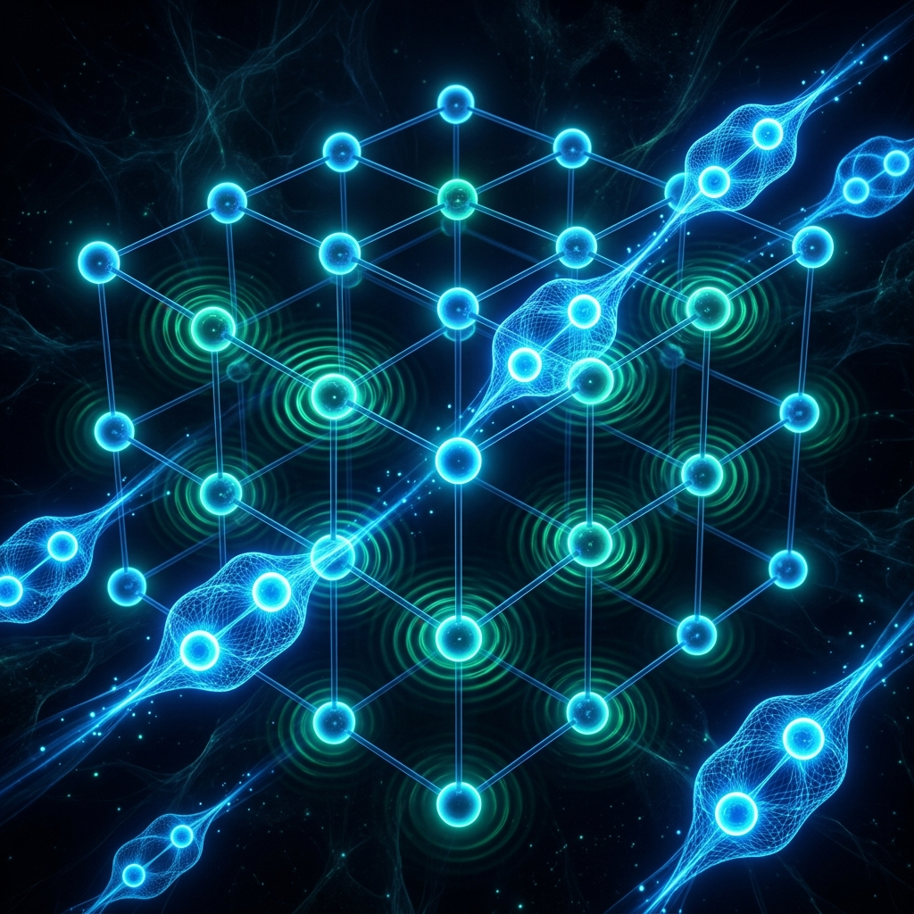

# Kuantum Temelleri: BCS Teorisi ve Cooper Çiftleri

<p align="center">
  
</p>

Süperiletkenlik, basitçe elektriksel direncin sıfıra düşmesi değil, makroskopik ölçekte gözlemlenebilen ve kendine özgü termodinamik ve elektromanyetik kuralları olan kolektif bir kuantum durumudur. Klasik Drude modeline göre, iletkenlerdeki serbest elektronlar kristal kafes yapısındaki termal titreşimler (fononlar) ve kusurlarla saçılma (scattering) yaşayarak kinetik enerjilerini ısıya dönüştürürler (Joule ısınması). Süperiletkenlerde ise kritik sıcaklığın ($T_c$) altında bu saçılma mekanizması tamamen ortadan kalkar.

Bu modülde, süperiletkenliğin kuantum mekaniksel temeli olan **BCS (Bardeen-Cooper-Schrieffer) Teorisi**, **Cooper Çiftleri** oluşumu, **Pippard Lokal Olmayan Elektrodinamiği** ve makroskopik **Ginzburg-Landau Teorisi** analitik olarak incelenmektedir.

---

## 1. Kristal Kafes ve Elektron-Fonon Etkileşimi

Klasik olarak iki elektron, aralarındaki Coulomb itme kuvveti nedeniyle birbirini iter:

$$V_c(\mathbf{r}) = \frac{e^2}{4\pi\varepsilon_0 r}$$

Ancak, polarize olabilen esnek bir kristal kafes (lattice) yapısında, elektronlar arasında dolaylı bir çekici kuvvet oluşabilir. Bu etkileşim **elektron-fonon etkileşimi** olarak adlandırılır.

```
       Elektron 1               Kristal Kafes (Pozitif İyonlar)          Elektron 2
     (Kafesi polarize eder)           (Lokal artı yük yoğunluğu)          (Çekim hisseder)
          └───► [e-] ───────────►   (+)  (+)  (+)   ◄─────────── [e-] ───┘
                                   (+)    (+)    (+)
```

### Mekanizma:
1. **Lokal Polarizasyon:** Kristal içinde hareket eden bir elektron, etrafındaki pozitif yüklü metal iyonlarını (örneğin $Pb^{2+}$ veya $Nb^{5+}$) Coulomb çekimi nedeniyle kendine doğru çeker. İyonların kütlesi elektronlara kıyasla çok büyük olduğundan ($M \gg m_e$), iyonların bu hareketi ve geri dönmesi (titreşimi) elektronun geçiş hızına göre çok yavaştır.
2. **Pozitif Yük Yoğunluğu:** İlk elektron bölgeden uzaklaştıktan sonra bile, o bölgede pozitif iyonların oluşturduğu geçici (saniyede $\sim 10^{-13}$ saniye süren) lokal bir artı yük yoğunluğu kalır.
3. **Çekim Etkisi:** Arkadan gelen ikinci bir elektron, bu lokal artı yük yoğunluğuna doğru çekilir. Böylece, doğrudan birbirini itmesi gereken iki elektron, kristal kafesin esnekliği (fonon alışverişi) sayesinde efektif olarak birbirini çekmiş olur.

### Hamiltonian Modellemesi:
Elektron-fonon etkileşimi içeren efektif elektron-elektron Hamiltonian'ı Fröhlich dönüşümü ile şu şekilde ifade edilir:

$$H_{eff} = \sum_{\mathbf{k},\sigma} \varepsilon_{\mathbf{k}} c_{\mathbf{k}\sigma}^\dagger c_{\mathbf{k}\sigma} + \frac{1}{2} \sum_{\mathbf{k},\mathbf{k}',\mathbf{q}} V_{eff}(\mathbf{q}) c_{\mathbf{k}+\mathbf{q},\sigma}^\dagger c_{\mathbf{k}'-\mathbf{q},\sigma'}^\dagger c_{\mathbf{k}',\sigma'} c_{\mathbf{k},\sigma}$$

Burada efektif etkileşim potansiyeli $V_{eff}(\mathbf{q})$:

$$V_{eff}(\mathbf{q}) = |M_{\mathbf{q}}|^2 \frac{2\hbar\omega_{\mathbf{q}}}{(\varepsilon_{\mathbf{k}+\mathbf{q}} - \varepsilon_{\mathbf{k}})^2 - (\hbar\omega_{\mathbf{q}})^2} + V_c(\mathbf{q})$$

* $M_{\mathbf{q}}$: Elektron-fonon matris elemanı.
* $\hbar\omega_{\mathbf{q}}$: Sanal fononun enerjisi.
* $\varepsilon_{\mathbf{k}+\mathbf{q}} - \varepsilon_{\mathbf{k}}$: Elektronlar arasındaki enerji değişimi.
* $V_c(\mathbf{q})$: Doğrudan Coulomb itme potansiyeli.

Eğer elektronların enerji farkı, fonon enerjisinden küçükse ($|\varepsilon_{\mathbf{k}+\mathbf{q}} - \varepsilon_{\mathbf{k}}| < \hbar\omega_{\mathbf{q}}$), denklemin ilk terimi negatif (çekici) olur. Bu çekim, Coulomb itmesini ($V_c$) yenebilecek büyüklükte olduğunda net etkileşim çekici hale gelir ($V_{eff} < 0$).

---

## 2. Cooper Çiftleri ve Fermi Yüzeyi Kararsızlığı

Leon Cooper (1956), Fermi denizinin (Fermi sea) üzerinde bulunan iki elektronun, ne kadar zayıf olursa olsun net bir çekici potansiyel ($V$) altında bağlı bir durum (bound state) oluşturabileceğini matematiksel olarak kanıtlamıştır.

### Matematiksel İspat:
Fermi enerjisi $E_F$ seviyesine kadar tüm kuantum durumlarının dolu olduğu bir sistem düşünelim. Fermi yüzeyinin hemen dışına ($E > E_F$) iki elektron ekleyelim. Bu iki elektronun dalga fonksiyonu $\psi(\mathbf{r}_1, \mathbf{r}_2)$ spin-singlet (zıt spinli) ve zıt momentumlu ($\mathbf{k}$ ve $-\mathbf{k}$) olacak şekilde kurulur:

$$\psi(\mathbf{r}_1, \mathbf{r}_2) = \left[ \sum_{\mathbf{k}} g_{\mathbf{k}} e^{i\mathbf{k}\cdot(\mathbf{r}_1 - \mathbf{r}_2)} \right] \frac{1}{\sqrt{2}} (|\uparrow\downarrow\rangle - |\downarrow\uparrow\rangle)$$

Schrödinger denklemi çözüldüğünde, bağlı durumun enerjisi $E$, serbest iki elektronun taban enerjisinden ($2E_F$) daha düşük çıkar:

$$E \approx 2E_F - 2\hbar\omega_D e^{-2/N(0)V}$$

* $\omega_D$: Debye frekansı (kristal kafesin maksimum titreşim frekansı).
* $N(0)$: Fermi seviyesindeki durum yoğunluğu (density of states).
* $V$: Çekici etkileşimin şiddeti.

Enerjinin $2E_F$ değerinden daha küçük çıkması ($E < 2E_F$), sistemin bu iki elektronu bağlı tutarak daha kararlı bir enerji seviyesine indiğini gösterir. Bu bağlı elektron çiftine **Cooper Çifti** denir. Cooper çiftini oluşturan elektronların özellikleri:
- **Momentum:** $\mathbf{p}_1 + \mathbf{p}_2 = 0$ (Zıt momentumlu: $\mathbf{k}$ ve $-\mathbf{k}$)
- **Spin:** $\mathbf{s}_1 + \mathbf{s}_2 = 0$ (Zıt spinli singlet durum: $S=0$)
- **Uzamsal Boyut (Koherens Boyu - $\xi_0$):** Çifti oluşturan elektronlar arasındaki efektif mesafe oldukça geniştir (tipik olarak $100\text{ nm}$ ile $1000\text{ nm}$ arası). Bu mesafe metal içindeki atomlar arası mesafeden ($\sim 0.1\text{ nm}$) çok daha büyüktür. Dolayısıyla milyonlarca Cooper çifti uzayda üst üste biner (overlap).

---

## 3. Pippard Lokal Olmayan Elektrodinamiği

London denklemleri, $\mathbf{J}_s(\mathbf{r})$ akım yoğunluğunu aynı noktadaki $\mathbf{A}(\mathbf{r})$ vektör potansiyeline doğrudan bağlar (lokal ilişki):

$$\mathbf{J}_s(\mathbf{r}) = -\frac{n_s e^2}{m} \mathbf{A}(\mathbf{r})$$

Ancak Brian Pippard (1953), Cooper çiftlerinin sonlu bir koherens boyuna ($\xi_0$) sahip olmasından dolayı, bir noktadaki akım yoğunluğunun o noktanın etrafındaki $\xi_0$ yarıçaplı bir hacimdeki vektör potansiyellerinin ortalamasından etkilenmesi gerektiğini öne sürmüştür (lokal olmayan elektrodinamik).

### Pippard'ın Modifiye London Denklemi:
Pippard, akım yoğunluğu için oda sıcaklığındaki metallerdeki anomal deri etkisi (anomalous skin effect) formülasyonuna benzer şekilde şu integrali önermiştir:

$$\mathbf{J}_s(\mathbf{r}) = -\frac{3 n_s e^2}{4\pi \xi_0 m \chi_0} \int \frac{\mathbf{R} (\mathbf{R} \cdot \mathbf{A}(\mathbf{r}'))}{R^4} e^{-R/\xi} d\mathbf{r}'$$

Burada $\mathbf{R} = \mathbf{r} - \mathbf{r}'$, $\chi_0$ malzeme sabiti ve $\xi$ efektif koherens boyudur:

$$\frac{1}{\xi} = \frac{1}{\xi_0} + \frac{1}{\ell}$$

* $\ell$: Elektronların ortalama serbest yolu (mean free path).
* $\xi_0$: Saf malzemenin içsel koherens boyu:
  
  $$\xi_0 = a \frac{\hbar v_F}{k_B T_c}$$
  
  (Burada $a$ sabiti BCS teorisine göre $0.18$ olarak hesaplanır, $v_F$ Fermi hızıdır).

Eğer malzeme çok kirliyse ($\ell \ll \xi_0$), efektif koherens boyu kısalır ($\xi \approx \ell$) ve manyetik nüfuz derinliği ($\lambda$) artar. Bu durum, süperiletkenin elektromanyetik karakterini doğrudan değiştirir.

---

## 4. BCS Taban Durumu Dalga Fonksiyonu

Cooper çiftleri bozon benzeri davranış gösterirler (toplam spinleri $S=0$ olduğu için). Ancak tam anlamıyla bağımsız bozonlar değillerdir çünkü Fermi-Dirac istatistiğine tabi elektronlardan oluşurlar. Bardeen, Cooper ve Schrieffer, tüm sistemin kolektif taban durumunu (ground state) tanımlayan çok-parçacıklı dalga fonksiyonunu ($\Psi_{BCS}$) şu şekilde önermişlerdir:

$$|\Psi_{BCS}\rangle = \prod_{\mathbf{k}} \left( u_{\mathbf{k}} + v_{\mathbf{k}} c_{\mathbf{k}\uparrow}^\dagger c_{-\mathbf{k}\downarrow}^\dagger \right) |0\rangle$$

Burada:
* $|0\rangle$: Elektron içermeyen vakum durumu.
* $v_{\mathbf{k}}$: $(\mathbf{k}\uparrow, -\mathbf{k}\downarrow)$ Cooper çiftinin dolu olma olasılık genliği.
* $u_{\mathbf{k}}$: İlgili durumun boş olma olasılık genliği.

Olasılıklerin korunumu gereği:

$$|u_{\mathbf{k}}|^2 + |v_{\mathbf{k}}|^2 = 1$$

Bu dalga fonksiyonu, tüm elektronların tek bir kuantum fazına ($\theta$) kilitlendiği, makroskopik bir koherent durum ifade eder. Saçılma yaşanmamasının temel sebebi budur; tek bir elektronun saçılması, bu makroskopik koherent yapıyı bozmaya yetmez. Sistemi bozmak için tüm Cooper çiftlerini birden kıracak düzeyde büyük bir enerji (minimum $2\Delta$) uygulanmalıdır.

---

## 5. Ginzburg-Landau (GL) Makroskopik Teorisi

1950 yılında, BCS teorisinden yedi yıl önce, Vitaly Ginzburg ve Lev Landau, süperiletkenliği faz geçişi fenomenolojisi çerçevesinde açıklayan makroskopik bir teori geliştirdiler. Bu teori, karmaşık sınır koşullarında ve manyetik alan altında süperiletkenlerin davranışını (özellikle Tip-II davranışı ve girdap yapılarını) çözmek için günümüzde bile BCS teorisinden çok daha pratik ve yaygındır.

### Kuantum Düzen Parametresi (Order Parameter):
Ginzburg-Landau teorisi, süperiletken elektronların yerel yoğunluğunu ($n_s$) temsil eden karmaşık bir düzen parametresi ($\Psi$) tanımlar:

$$\Psi(\mathbf{r}) = |\Psi(\mathbf{r})| e^{i\theta(\mathbf{r})}$$

Burada $|\Psi(\mathbf{r})|^2 = n_s(\mathbf{r})$ süperiletken elektron yoğunluğudur (Cooper çifti yoğunluğu).

### Serbest Enerji Açınımı (Free Energy Expansion):
Kritik sıcaklığa ($T_c$) yakın sıcaklıklarda, $\Psi$ küçük bir değere sahip olduğundan, süperiletken durumun serbest enerjisi ($f_s$), normal durumun serbest enerjisi ($f_n$) cinsinden Taylor serisine açılabilir:

$$f_s = f_n + \alpha |\Psi|^2 + \frac{\beta}{2} |\Psi|^4 + \frac{1}{2m^*} \left| \left( -i\hbar\nabla - e^* \mathbf{A} \right) \Psi \right|^2 + \frac{\mathbf{B}^2}{2\mu_0}$$

* $\alpha, \beta$: Fenomenolojik sıcaklık bağımlı parametreler. $\alpha(T) \propto (T - T_c)$.
* $m^* = 2m_e$: Cooper çiftinin efektif kütlesi.
* $e^* = 2e$: Cooper çiftinin yükü.
* $\mathbf{A}$: Vektör potansiyeli ($\mathbf{B} = \nabla \times \mathbf{A}$).

### Ginzburg-Landau Denklemleri:
Serbest enerjiyi $\Psi^*$ ve $\mathbf{A}$ bileşenlerine göre varyasyonel olarak minimize ettiğimizde, süperiletkenliği karakterize eden iki temel diferansiyel denklem elde ederiz:

#### Birinci GL Denklem (Düzen Parametresi Değişimi):
$$\frac{1}{2m^*} \left( -i\hbar\nabla - e^* \mathbf{A} \right)^2 \Psi + \alpha \Psi + \beta |\Psi|^2 \Psi = 0$$

#### İkinci GL Denklem (Süperiletken Akım Yoğunluğu):
$$\mathbf{J}_s = \frac{e^* \hbar}{2m^* i} \left( \Psi^* \nabla \Psi - \Psi \nabla \Psi^* \right) - \frac{(e^*)^2}{m^*} |\Psi|^2 \mathbf{A}$$

Bu denklemler, süperiletken dalga fonksiyonunun dış alanlar altındaki uzamsal dağılımını kusursuz bir şekilde açıklar ve Abrikosov girdaplarının (vortices) matematiksel çıkış noktasıdır.

---

## 6. Kuantum Enerji Boşluğu (Energy Gap - $\Delta$)

Kritik sıcaklığın altında, süperiletkenin tek-parçacık uyarılma spektrumunda (excitation spectrum) bir enerji boşluğu ($\Delta$) oluşur. Cooper çiftlerini kırıp normal elektron (quasi-particle) üretmek için gereken minimum enerji $2\Delta$ kadardır.

```
       Normal Metal                           Süperiletken
    (Sürekli Enerji Spektrumu)           (Kuantum Enerji Boşluğu)

         E                                     E
         │  ▒▒▒▒▒▒▒▒                           │  ▒▒▒▒▒▒▒▒  Uyarılmış Durumlar
         │  ▒▒▒▒▒▒▒▒                           ├─────────── E_F + Δ
         ├─────────── E_F                      │   Boşluk   (2Δ)
         │  ████████                           ├─────────── E_F - Δ
         │  ████████                           │  ████████  Cooper Çiftleri
         └───────────                          └───────────
```

### Gap Denklemi:
Kendiyle uyumlu (self-consistent) BCS gap denklemi şu şekildedir:

$$\Delta_{\mathbf{k}} = -\sum_{\mathbf{k}'} V_{\mathbf{k}\mathbf{k}'} \frac{\Delta_{\mathbf{k}'}}{2E_{\mathbf{k}'}} \tanh\left(\frac{E_{\mathbf{k}'}}{2k_B T}\right)$$

Burada uyarılma enerjisi $E_{\mathbf{k}} = \sqrt{(\varepsilon_{\mathbf{k}} - \mu)^2 + \Delta_{\mathbf{k}}^2}$ olarak tanımlanır.

### Sıcaklık Bağımlılığı:
Enerji boşluğu $\Delta(T)$, sıcaklık arttıkça Cooper çiftlerinin termal olarak kırılması nedeniyle küçülür ve tam olarak $T = T_c$ noktasında sıfıra iner.

$$\frac{\Delta(T)}{\Delta(0)} \approx 1.74 \sqrt{1 - \frac{T}{T_c}} \quad \left(T \to T_c \text{ limitinde}\right)$$

Sıfır Kelvin'deki enerji boşluğu ile kritik sıcaklık arasındaki BCS bağıntısı evrensel bir sabittir:

$$2\Delta(0) = 3.53 \, k_B T_c$$

---

## 7. Termodinamik Öngörüler: Özgül Isı Sıçraması

BCS teorisi, normal durumdan süperiletken duruma geçişin ikinci derece bir faz geçişi (second-order phase transition) olduğunu öngörür. Bu geçiş sırasında elektronik özgül ısı ($C_{es}$) kapasitesinde karakteristik bir sıçrama (singularity) ve ardından üstel bir düşüş gözlenir.

### Matematiksel Analiz:
1. **Kritik Sıcaklıktaki Sıçrama ($T = T_c$):**
   BCS teorisine göre, süperiletken durumdaki özgül ısı ($C_{es}$) ile normal durumdaki özgül ısı ($C_{en}$) arasındaki fark $T_c$ sıcaklığında tam olarak şudur:

   $$\frac{C_{es}(T_c) - C_{en}(T_c)}{C_{en}(T_c)} = 1.43$$

   Bu sıçrama, Cooper çiftlerinin oluşmaya başlamasıyla entropinin ani bir şekilde düşmesinden kaynaklanır. Ginzburg-Landau parametreleri cinsinden de bu sıçrama serbest enerjinin ikinci türevi alınarak hesaplanabilir.
2. **Düşük Sıcaklık Limiti ($T \ll T_c$):**
   Çok düşük sıcaklıklarda, uyarılmaların gerçekleşmesi kuantum enerji boşluğu ($\Delta$) nedeniyle zorlaşır. Özgül ısı, Boltzmann faktörüne bağlı olarak üstel (exponential) olarak azalır:

   $$C_{es}(T) \propto e^{-\frac{\Delta(0)}{k_B T}}$$

   Normal metallerde ise özgül ısı sıcaklıkla lineer değişir ($C_{en} = \gamma T$). Bu üstel düşüş, süperiletkenlerde bir enerji boşluğunun varlığının en doğrudan deneysel kanıtıdır.

---

## Referanslar ve İleri Okuma
1. Bardeen, J., Cooper, L. N., & Schrieffer, J. R. (1957). "Theory of Superconductivity". *Physical Review*, 108(5), 1175.
2. Ginzburg, V. L., & Landau, L. D. (1950). "On the theory of superconductivity". *Zh. Eksp. Teor. Fiz.*, 20, 1064.
3. Pippard, A. B. (1953). "An experimental and theoretical study of the relation between magnetic field and current in a superconductor". *Proceedings of the Royal Society of London. Series A*, 216(1127), 547-568.
4. Tinkham, M. (2004). *Introduction to Superconductivity*. Courier Corporation.
