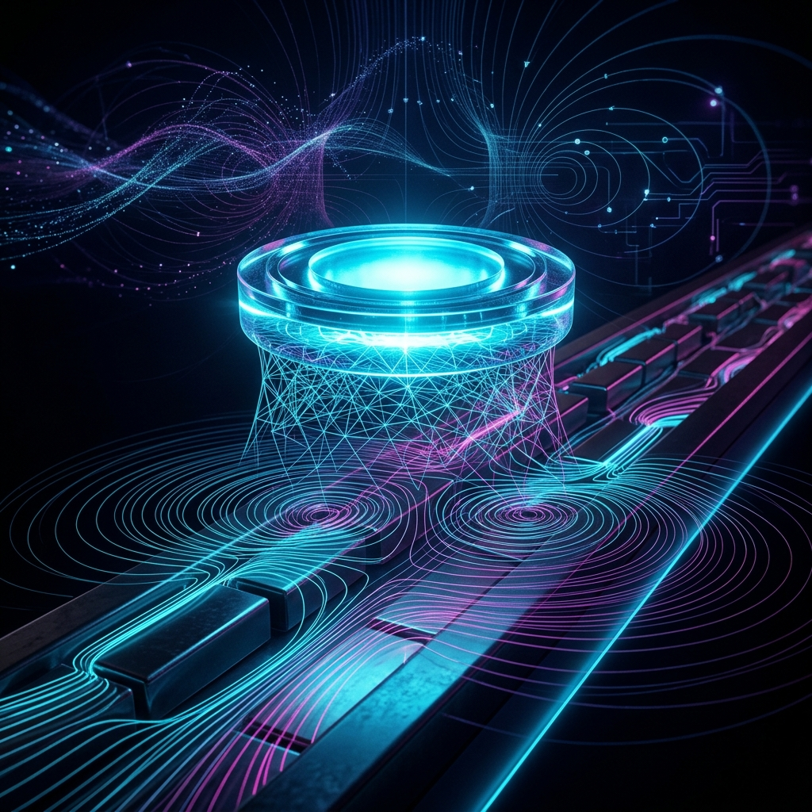

# Meissner Etkisi, Tip-I/Tip-II Ayrımı ve Manyetik Levitasyon

<p align="center">
  
</p>

Süperiletkenliğin en büyüleyici özelliklerinden biri olan **manyetik levitasyon**, sadece sıfır direncin değil, malzemenin içinde manyetik alan barındırmaması olarak tanımlanan **kusursuz diyamanyetizma** (Meissner Etkisi) ve **manyetik akı çivilemesi** (flux pinning) gibi kuantum mekaniksel olguların bir bileşimidir.

Bu modülde, manyetik alan-süperiletken etkileşiminin matematiksel teorisi (London Denklemleri), malzeme sınıflandırmaları, **Abrikosov Girdap Kafesi**, **Mıknatıslanma Giderim Faktörü** ve bu olguların mühendislik uygulamalarındaki dinamikleri incelenmektedir.

---

## 1. Kusursuz İletkenlik vs. Kusursuz Diyamanyetizma: Meissner Etkisi

Süperiletkenliği sadece "direnci sıfır olan bir malzeme" (kusursuz iletken) olarak hayal etmek, elektromanyetik davranışını açıklamak için yetersizdir. Klasik elektrodinamik ve Maxwell denklemleri kullanılarak yapılan analiz, kusursuz bir iletkenin içindeki manyetik akının zamanla değişemeyeceğini söyler ($\frac{\partial \mathbf{B}}{\partial t} = 0$).

```
        Klasik Kusursuz İletken                      Meissner Etkisi (Süperiletken)
    (T < T_c durumunda alan uygulanırsa)          (Sıcaklıktan bağımsız olarak alan dışlanır)

         ┌─── T > T_c ───┐   ┌─── T < T_c ───┐       ┌─── T > T_c ───┐   ┌─── T < T_c ───┐
         │               │   │   Alan        │       │               │   │   Manyetik    │
         │   B-Alanı     │   │   Hapsedilir  │       │   B-Alanı     │   │   Alan        │
       ══╪═══► ░░░ ══════╪═══╪═══► ░░░ ══════╪══   ══╪═══► ░░░ ══════╪═══╪═══► ( ) ══════╪══
         │   ░░░         │   │   ░░░         │       │   ░░░         │   │  (   ) Dışlanır
         └───────────────┘   └───────────────┘       └───────────────┘   └───────────────┘
```

### Karşılaştırma:
* **Kusursuz İletken (Klasik):** Malzeme önce soğutulup direnci sıfır yapıldıktan sonra bir manyetik alan uygulanırsa, Faraday yasası gereği malzeme yüzeyinde indüklenen girdap akımları (eddy currents) iç alanı sıfır tutar. Ama malzeme manyetik alan içindeyken soğutulursa (Field Cooling), alan malzemenin içinde hapsolur. Dış alan kaldırılsa bile iç alan değişmez.
* **Süperiletken (Kuantum):** Malzeme manyetik alan altındayken $T_c$'nin altına soğutulduğu anda, soğutma sırasından bağımsız olarak içindeki tüm manyetik akı çizgilerini dışarı atar. Malzemenin içindeki manyetik akı yoğunluğu her zaman sıfırdır:
  
  $$\mathbf{B} = \mu_0(\mathbf{H} + \mathbf{M}) = 0 \implies \chi = \frac{\mathbf{M}}{\mathbf{H}} = -1$$

---

## 2. London Denklemleri ve Manyetik Nüfuz Derinliği

1. ve 2. London denklemleri (1935), süperiletken içindeki sıfır direnç ve Meissner etkisini açıklamak amacıyla Maxwell denklemlerine yapılan kuantum uyumlu modifikasyonlardır.

### Birinci London Denklemi (Sıfır Direnç):
$$\frac{\partial \mathbf{J}_s}{\partial t} = \frac{n_s e^2}{m} \mathbf{E}$$

### İkinci London Denklemi (Meissner Etkisi):
$$\nabla \times \mathbf{J}_s = -\frac{n_s e^2}{m} \mathbf{B}$$

### Manyetik Nüfuz Derinliği ($\lambda_L$):
Ampere yasası ($\nabla \times \mathbf{B} = \mu_0 \mathbf{J}_s$) ve vektör kimliği kullanılarak, tek boyutlu düzlemsel bir süperiletken sınırında manyetik alanın çözümü yapılırsa:

$$\nabla^2 \mathbf{B} = \frac{1}{\lambda_L^2} \mathbf{B} \quad \implies \quad B(x) = B_0 e^{-x/\lambda_L}$$

Burada **London Manyetik Nüfuz Derinliği ($\lambda_L$)** şu şekilde tanımlanır:

$$\lambda_L = \sqrt{\frac{m}{\mu_0 n_s e^2}}$$

Bu denklem, manyetik alanın süperiletkenin içine tamamen giremediğini, yalnızca yüzeyde $\lambda_L$ kalınlığında (genellikle $50-200\text{ nm}$) çok ince bir katmanda sönümlendiğini gösterir.

---

## 3. Mıknatıslanma Giderim Faktörü (Demagnetization Factor - D)

Pratikte, süperiletken malzemeler sonsuz büyüklükte değildir ve sonlu geometrilere sahiptirler (küre, silindir, ince film). Bu sonlu geometriler nedeniyle süperiletkenin etrafındaki manyetik alan çizgileri bükülür ve malzemenin uçlarında yerel manyetik alanın şiddeti dış alana ($H_a$) kıyasla artış gösterir. Bu durum **Mıknatıslanma Giderimi** ile açıklanır.

### İç Manyetik Alan ($H_{in}$):
Süperiletken içindeki efektif manyetik alan şu şekildedir:

$$H_{in} = H_a - D M$$

* $H_a$: Dışarıdan uygulanan manyetik alan.
* $M$: Malzemenin mıknatıslanması (Meissner durumunda $M = -H_{in}$).
* $D$: **Mıknatıslanma Giderim Faktörü**. Geometriye bağlı bir tensördür ve izotropik durumlarda bileşenleri toplamı $\sum D_i = 1$ şeklindedir.

### Çeşitli Geometriler İçin D Değerleri:
1. **Sonsuz Uzun İnce Silindir (Boyuna Alan):** Manyetik alan silindir eksenine paralel ise alan çizgilerinde bükülme olmaz:
   
   $$D = 0 \implies H_{in} = H_a$$

2. **Küre (Kusursuz Küresel Yapı):** Manyetik alan her yönde aynı etkiyi yapar:
   
   $$D = \frac{1}{3} \implies H_{in} = \frac{3}{2} H_a \quad (\text{Ekvatorda yerel alan } 1.5 \text{ kat artar.})$$

3. **Sonsuz Düz Levha (Alana Dik Düzlem):** İnce filmler veya plakalar alana dik yerleştirilirse:
   
   $$D \to 1 \implies H_{in} = \frac{1}{1-D} H_a \to \infty$$

**Geometrik Sonuç (Arakesit Durumu - Intermediate State):** 
D'nin sıfırdan büyük olduğu durumlarda ($D > 0$), yerel alan malzemenin belirli bölgelerinde kritik alanın ($H_c$) üzerine çıkabilir. Bu durum, Tip-I süperiletkenlerde malzemenin tamamen normale geçmesi yerine, **süperiletken ve normal metal şeritlerin bir arada bulunduğu "Arakesit Durumu" (Intermediate State)** oluşturmasına sebep olur.

---

## 4. Tip-I ve Tip-II Süperiletkenler

Malzemeler, manyetik alana verdikleri tepkiye göre iki sınıfa ayrılırlar. Bu ayrım Ginzburg-Landau parametresi olan $\kappa = \lambda/\xi$ ile belirlenir.

### 1. Tip-I Süperiletkenler ($\kappa < 1/\sqrt{2}$):
- Tek bir kritik manyetik alan değerine ($H_c$) sahiptirler. Alan $H_c$'yi geçtiği anda süperiletkenlik aniden ve tamamen yok olur. Çoğunlukla saf metallerdir (Kurşun, Civa, Kalay).

### 2. Tip-II Süperiletkenler ($\kappa > 1/\sqrt{2}$):
- İki farklı kritik manyetik alan değerine sahiptirler: Alt kritik alan ($H_{c1}$) ve üst kritik alan ($H_{c2}$). $H_{c1} < H < H_{c2}$ aralığında **Karmaşık Durum (Mixed / Vortex State)** yaşanır. Bu durumda akı kuantumları girdaplar halinde içeri girer. Alaşımlar ve seramiklerdir ($Nb_3Sn$, $YBCO$, $MgB_2$).

---

## 5. Abrikosov Girdap Kafesi (Vortex Lattice)

Tip-II süperiletkenlerin karmaşık durumunda ($H_{c1} < H < H_{c2}$), manyetik alan içeriye kuantize edilmiş **Abrikosov Girdapları (Vortices)** halinde nüfuz eder.

```
                  Abrikosov Üçgen Girdap Kafesi (Top View)
                  
                        ( Φ_0 )         ( Φ_0 )
                           \           /
                            \         /
                             ( Φ_0 ) 
                            /         \
                           /           \
                        ( Φ_0 )         ( Φ_0 )
```

### Tek Bir Girdabın Manyetik Alan Dağılımı ($B(r)$):
London modeline göre, merkezinden bir akı kuantumu ($\Phi_0$) geçen izole bir girdabın merkezden $r$ uzaklığındaki manyetik alan dağılımı şu diferansiyel denklemin çözümüyle elde edilir:

$$B(r) - \lambda^2 \nabla^2 B(r) = \Phi_0 \delta^2(\mathbf{r})$$

Çözüm, sıfırıncı dereceden modifiye Bessel fonksiyonudur ($K_0$):

$$B(r) = \frac{\Phi_0}{2\pi\lambda^2} K_0\left(\frac{r}{\lambda}\right)$$

* **Yakın Limit ($r \ll \lambda$):** Manyetik alan logaritmik olarak artar: $B(r) \approx \frac{\Phi_0}{2\pi\lambda^2} \ln(\lambda/r)$. (Girdap çekirdeğinde $r \approx \xi$ sınırında kesilir).
* **Uzak Limit ($r \gg \lambda$):** Manyetik alan üstel olarak sönümlenir: $B(r) \propto e^{-r/\lambda}$.

### Girdap Kafesi Geometrisi:
Girdaplar, içlerinden geçen manyetik akı çizgileri nedeniyle birbirlerini iten manyetik dipoller gibi davranırlar. Bu karşılıklı itme enerjisini minimize etmek için girdaplar uzayda düzenli bir geometrik kafes (vortex lattice) oluştururlar.
- **Üçgen (Triangular/Hexagonal) Kafes:** Çoğu süperiletkende serbest enerjiyi en çok minimize eden kararlı yapı **üçgen kafestir**. Bu durum ilk kez Alexei Abrikosov tarafından teorik olarak öngörülmüş ve daha sonra nötron saçılması deneyleriyle doğrulanmıştır.
- **Kare (Square) Kafes:** Bazı anizotropik kristal yapılarda ve çok yüksek alanlarda kare kafes geometrisi de gözlemlenebilir.

---

## 6. Manyetik Akı Çivileme (Flux Pinning)

Lorentz kuvveti ($\mathbf{f}_L = \mathbf{J} \times \mathbf{\Phi}_0$) nedeniyle akım altında hareket eden girdaplar enerji kaybına ve direnç oluşumuna (akı akışı direnci - flux flow resistance) sebep olur.

### Çivileme Kuvveti ($F_p$):
Girdapların hareketini durdurmak için malzeme içindeki kristal kusurları (boşluklar, dislokasyonlar, tane sınırları) kullanılır. Bir girdabın çivilenmesi, malzemenin taşıyabileceği kritik akım yoğunluğunu ($J_c$) belirleyen en temel unsurdur. Lorentz kuvveti, toplam çivileme gücünü ($F_p$) aşmadığı sürece sıfır direnç korunur:

$$J_c B < F_p$$

---

## 7. Süperiletken Levitasyon ve Maglev Dinamikleri

Manyetik levitasyonda süperiletken kullanımı, klasik elektromanyetik yataklamalara (EMS) kıyasla devasa avantajlar sunar. Earnshaw teoremine göre, kalıcı mıknatıslar ve klasik statik alanlar kullanılarak havada stabil, kararlı bir yataklama tasarlamak imkansızdır. Sistem her zaman bir yöne doğru kaçar ve devrilir.

Ancak süperiletkenlerde akı çivilemesi sayesinde pasif kararlılık (self-stabilization) elde edilir:

```
            Süperiletken Ray Üstünde Stabil Maglev Kilitlenmesi

                 [ Süperiletken Araç / Yatak ]
                     │  🌀    🌀  │  (Çivilenmiş Akı Çizgileri)
            ─────────┼──┼──────┼──┼─────────
                     │  ▼      ▼  │
                    [ Kalıcı Mıknatıs Ray ]
```

### Dinamik Parametreler:
1. **Dikey Sertlik (Vertical Stiffness):** Süperiletken mıknatısa yaklaştırıldığında veya uzaklaştırıldığında oluşan geri çağırıcı kuvvetin dikliğidir. Bu sertlik, trenin dikey salınımlarını sönümler.
2. **Yatay Kılavuzluk Kuvveti (Lateral Guidance Force):** Treni rayın ortasında tutan, virajlarda dışarı savrulmasını engelleyen pasif kuvvettir. Akı çivileme derecesi ne kadar yüksekse, kılavuzluk kuvveti o kadar güçlüdür.

---

## Referanslar ve İleri Okuma
1. London, F., & London, H. (1935). "The Electromagnetic Equations of the Supraconductor". *Proceedings of the Royal Society of London. Series A*, 149(866), 71-88.
2. Abrikosov, A. A. (1957). "On the Magnetic Properties of Superconductors of the Second Group". *Soviet Physics JETP*, 5, 1174.
3. Brandt, E. H. (1995). "The flux-line lattice in unconventional superconductors". *Reports on Progress in Physics*, 58(11), 1465.
4. Osborn, J. A. (1945). "Demagnetizing Factors of the General Ellipsoid". *Physical Review*, 67(11-12), 351.
