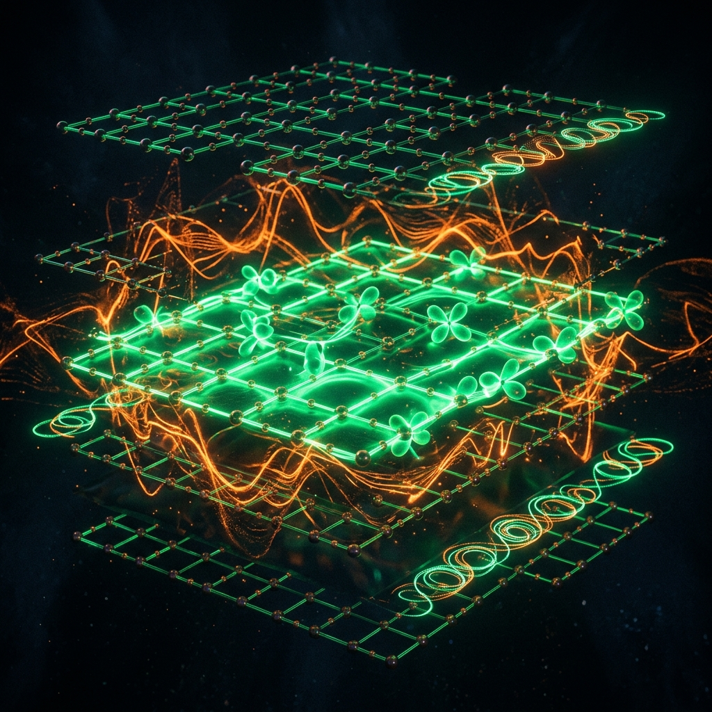

# Yüksek Sıcaklık Süperiletkenleri, Bakıratlar ve Topolojik Süperiletkenlik

<p align="center">
  
</p>

1986 yılına kadar fizik camiası, süperiletkenliğin kritik sıcaklık limitinin $30\text{ K}$ civarında olduğunu öngören geleneksel BCS teorisine inanıyordu (McMillan Limiti). Ancak Georg Bednorz ve K. Alex Müller'in Lantanyum Baryum Bakır Oksit ($LaBaCuO$) seramik sisteminde $35\text{ K}$ sıcaklıkta süperiletkenlik keşfetmesi (1987 Nobel Fizik Ödülü), katıhal fiziğinde yeni bir çığır açmıştır. Bu keşfi takip eden yıllarda kritik sıcaklığı $93\text{ K}$ olan **YBCO** ve $110\text{ K}$ olan **BSCCO** gibi **Yüksek Sıcaklık Süperiletkenleri (HTS - High-Temperature Superconductors)** keşfedilmiştir.

Bu modülde, HTS bakıratların (cuprates) kristal yapıları, Cooper çifti eşleşme mekanizmaları (**d-Dalgası Simetrisi**), karmaşık **Faz Diyagramı ve Sözde-Aralık (Pseudogap) Olgusu**, **Demir Tabanlı Süperiletkenler** ve kuantum hesaplamada devrim yaratma potansiyeline sahip **Topolojik Süperiletkenlik ve Majorana Sınır Durumları** incelenmektedir.

---

## 1. Bakıratların (Cuprates) Kristal Yapısı ve d-Dalgası Simetrisi

Tüm yüksek sıcaklıklı bakırat süperiletkenlerin ortak özelliği, iki boyutlu **Bakır-Oksijen ($CuO_2$) katmanlarına** sahip olmalarıdır. Süperiletkenlik ve elektriksel iletim neredeyse tamamen bu $CuO_2$ düzlemlerinde gerçekleşir. Katmanların arasındaki diğer metalik ve oksit tabakaları (örneğin Yttrium, Baryum, Bizmut veya Kalsiyum) bu düzlemlere elektron veya delik (hole) aktarımı yapan birer "yük rezervuarı" görevi görür.

```
       YBCO Kristal Yapısı İçindeki CuO2 Düzlemleri (Şematik)
       
              (O)─────────(Cu)─────────(O)
               │           │           │
               │           │           │
              (Cu)────────(O)─────────(Cu)   <─── Süperiletken İletim Düzlemi
               │           │           │
               │           │           │
              (O)─────────(Cu)─────────(O)
```

### d-Dalgası ($d_{x^2-y^2}$) Eşleşme Simetrisi:
Geleneksel LTS süperiletkenlerinde (örneğin $NbTi$), Cooper çiftlerinin kuantum dalga fonksiyonu **s-dalgası (s-wave)** simetrisine sahiptir. Bu simetride enerji boşluğu ($\Delta$) tüm Fermi yüzeyi boyunca izotropiktir (her yönde aynı büyüklüktedir).

Ancak bakıratlarda Cooper çiftleri arasındaki çekici kuvvet fononlardan ziyade antiferromanyetik spin dalgalanmalarından (magnonlar) kaynaklanır. Bu anizotropik çekim, Cooper çifti dalga fonksiyonunun Fermi yüzeyinde **d-dalgası ($d_{x^2-y^2}$)** simetrisine sahip olmasına neden olur.

```
          s-Dalgası (LTS)                      d-Dalgası (HTS)
         (İzotropik Boşluk)                  (Nodal ve Anti-Nodal Bölgeler)
         
               ┌─*─┐                               (\)  (+)  (/)
             *       *                               \       /
            *    +    *                           (-)  *  +  *  (-)
             *       *                               /       \
               └─*─┘                               (/)  (+)  (\)
```

### Matematiksel İfade:
d-dalgası simetrisinde, momentum uzayında ($\mathbf{k}$-space) kuantum enerji boşluğu ($\Delta$) yön bağımlıdır ve işaret değiştirir:

$$\Delta(\mathbf{k}) = \Delta_0 \left( \cos k_x a - \cos k_y a \right)$$

* **Anti-Nodal Bölgeler ($k_x = 0, k_y = \pi/a$ veya $k_x = \pi/a, k_y = 0$):** Enerji boşluğu maksimum değerini alır ($|\Delta| = \Delta_0$).
* **Nodal Noktalar ($|k_x| = |k_y|$):** Enerji boşluğu sıfırdır ($\Delta = 0$). Bu noktalarda süperiletkenlik uyarılmaları en düşük sıcaklıklarda bile enerji bariyeri olmadan gerçekleşebilir.

---

## 2. HTS Faz Diyagramı ve Sözde-Aralık (Pseudogap) Olgusu

Bakırat süperiletkenler, taşıyıcı yoğunluğunun (doping oranı $x$) değiştirilmesiyle dramatik kuantum faz geçişleri sergilerler. Bu durum, katıhal fiziğindeki en zengin ve karmaşık faz diyagramını ortaya çıkarır.

```
                     Bakırat HTS Basitleştirilmiş Faz Diyagramı
      Sıcaklık (T)
       ▲
       │        Sözde-Aralık
       │         (Pseudogap)           Garip Metal
       │          ┌───────┐           (Strange Metal)
       │          │       │           /
       │          │  HTS  │          /
       │  AF      │ Süper-│         /  Fermi Sıvısı
       │ Mott     │ iletken│        / (Fermi Liquid)
       │ Yalıtkan │  (SC) │       /
       └──────────┴───────┴──────┴─────────────► Katkılama (Doping - x)
         x=0     Under    Optimal Overdoped
```

### Faz Bölgeleri:
1. **Antiferromanyetik Mott Yalıtkanı ($x \approx 0$):** Katkılanmamış saf ana bileşik (örneğin $La_2CuO_4$), Coulomb itme kuvveti çok güçlü olduğu için elektronların hareket edemediği güçlü bir Mott yalıtkanıdır. Spinler antiferromanyetik olarak dizilmiştir.
2. **Süperiletken Kubbe (SC Dome):** Malzemeye delik katkılandıkça antiferromanyetizma hızla yok olur ve süperiletkenlik başlar. Kritik sıcaklık $T_c$, optimal katkılama noktasında ($x \approx 0.16$) maksimuma ulaşır.
3. **Sözde-Aralık (Pseudogap) Fazı ($T_c < T < T^*$ ve $x < 0.16$):** underdoped bölgede, malzemenin direnci sıfır olmadığı halde (yani süperiletken değilken), uyarılma spektrumunda bir enerji boşluğuna benzer kısmi bir boşluk (pseudogap) gözlenir. Fizikçiler arasında bu fazın, gerçek süperiletkenliğin öncüsü olan "faz-koherenssiz Cooper çiftleri" mi yoksa süperiletkenlikle yarışan başka bir kuantum düzeni (örneğin yük yoğunluğu dalgaları - charge density waves) mi olduğu hala tartışılmaktadır.
4. **Garip Metal (Strange Metal):** Optimal katkılama noktasının üzerinde, malzemenin elektriksel direnci sıcaklıkla son derece lineer bir ilişki sergiler ($\rho \propto T$). Bu durum klasik Landau Fermi-Sıvısı teorisiyle (burada direnç $\rho \propto T^2$ olmalıdır) tamamen çelişir ve garip metal fazı olarak adlandırılır.

---

## 3. Demir Tabanlı Süperiletkenler (Iron-Based Superconductors - Pnictides)

2008 yılında Hideo Hosono ve ekibi, demir tabanlı $LaFeAsO_{1-x}F_x$ bileşiğinde $26\text{ K}$ sıcaklıkta süperiletkenlik keşfederek, demir gibi güçlü bir ferromanyetik element içeren malzemelerin süperiletken olamayacağına dair 50 yıllık tabuyu yıkmıştır. Bugün bu ailede kritik sıcaklık $56\text{ K}$ seviyesine kadar çıkarılmıştır.

### Temel Özellikler:
* **Kristal Yapı:** Süperiletken iletim demir ve pniktojen (As, P) veya kalkojen (Se, Te) düzlemlerinde ($FeAs$ katmanları) gerçekleşir.
* **Çok Bantlı Yapı (Multi-band):** Bakıratların aksine, demir tabanlı süperiletkenlerde Fermi yüzeyi çoklu bantlardan (Fe $3d$ orbitalleri) oluşur. $MgB_2$'ye benzer şekilde çok bantlı kuantum davranışı sergilerler.
* **Eşleşme Simetrisi ($s_\pm$):** Cooper çiftleri ne klasik $s$-dalgası ne de bakıratlardaki $d$-dalgası simetrisine sahiptir. **$s_\pm$ simetrisi** olarak adlandırılan, Fermi yüzeyinin farklı ceplerinde (hole ve electron pockets) enerji boşluğunun işaret değiştirdiği ($+$ ve $-$) özgün bir çok bantlı s-dalgası yapısına sahiptirler.

---

## 4. Topolojik Süperiletkenlik ve Majorana Sınır Durumları (Majorana Bound States)

Topolojik süperiletkenlik, katıhal fiziğinin ve kuantum hesaplama teorisinin en heyecan verici sınırlarından biridir. Klasik süperiletkenlerin aksine, topolojik süperiletkenlerin iç bölgeleri yalıtkan veya süperiletken iken, **sınırlarında veya manyetik girdap çekirdeklerinde (vortex cores) sıfır enerjili Majorana korumalı kuantum durumları barındırırlar.**

```
                     Topolojik Süperiletken Girdap Çekirdeği
                     
                               Manyetik Akı çizgisi
                                      │
                                      ▼  (B-Alanı)
                                   ( 🌀 )  <── Girdap Çekirdeği (Vortex Core)
                                  /      \     (Majorana Zero Mode - E=0)
                                 (  γ=γ*  )
                                  \      /
                                   ( 🌀 )
```

### Majorana Fermiyonu Nedir?
Ettore Majorana (1937) tarafından teorize edilen Majorana fermiyonu, **kendisinin antiparçacığı olan parçacıktır** ($\gamma = \gamma^\dagger$). Kuantum bilgisayarlarında standart kuantum bitleri (qubitler) gürültüye karşı çok hassasken, Majorana durumları **topolojik olarak korunduğu** için gürültüden etkilenmeyen, hataya dayanıklı (fault-tolerant) topolojik kuantum bilgisayarlar tasarlamamıza olanak tanır.

### Kitaev Zincir Modeli (Kitaev Chain):
Alexei Kitaev (2001) tarafından önerilen tek boyutlu örgü modeli, topolojik süperiletkenliğin matematiksel temelidir. Bir spinless fermiyon zincirinde, komşu atomlar arasında p-dalgası ($p$-wave) süperiletken eşleşmesi ($ \Delta $) kurulduğunda Hamiltonian şu şekildedir:

$$H = -\mu \sum_{i=1}^N c_i^\dagger c_i - t \sum_{i=1}^{N-1} \left( c_i^\dagger c_{i+1} + c_{i+1}^\dagger c_i \right) + \Delta \sum_{i=1}^{N-1} \left( c_i^\dagger c_{i+1}^\dagger + c_{i+1} c_i \right)$$

Her bir kompleks fermiyonu iki adet Majorana operatörüne bölebiliriz ($c_i = \frac{1}{2}(\gamma_{i,1} + i\gamma_{i,2})$). Topolojik fazda ($\mu = 0, t = \Delta$):

$$H = i t \sum_{i=1}^{N-1} \gamma_{i,2} \gamma_{i+1,1}$$

Bu durumda, zincirin uçlarındaki $\gamma_{1,1}$ ve $\gamma_{N,2}$ Majorana operatörleri Hamiltonian'da yer almaz. Yani zincirin iki ucunda **sıfır enerjili serbest iki adet Majorana sınır durumu (Majorana Zero Modes - MZMs)** kalır. Bu iki uç durum uzayda birbirinden ayrılmış tek bir kuantum bitini (qubit) temsil eder. Qubitin bilgisi lokal olarak değil, tüm zincir boyunca topolojik olarak depolandığı için yerel gürültüler kuantum bilgisini bozamaz!

### Deneysel Gerçekleştirim Topolojileri:
Topolojik süperiletkenlik doğada saf olarak çok nadir bulunur. Bu nedenle, katıhal mühendisliği ile **yapay topolojik süperiletkenler** üretilmektedir:
1. **Yarı İletken Nano-Teller:** Güçlü spin-yörünge etkileşimi (spin-orbit coupling) olan bir yarı iletken nanotel (örneğin $InAs$ veya $InSb$), bir s-dalgası süperiletken (örneğin Alüminyum) üzerine yerleştirilir ve harici bir manyetik alan uygulanır. Sistem topolojik faza geçerek telin iki ucunda Majorana durumları oluşturur.
2. **Topolojik Yalıtkan / Süperiletken Arakesiti:** Bir topolojik yalıtkanın ($Bi_2Se_3$) yüzey durumları ile bir s-dalgası süperiletken arakesit oluşturduğunda, proximity etkisiyle yüzey durumları $p_x + i p_y$ süperiletkenliği kazanır. Manyetik girdapların merkezinde Majorana sıfır modları kilitlenir.

---

## Referanslar ve İleri Okuma
1. Bednorz, J. G., & Müller, K. A. (1986). "Possible High Tc Superconductivity in the Ba-La-Cu-O System". *Zeitschrift für Physik B Condensed Matter*, 64(2), 189-193.
2. Tinkham, M. (2004). *Introduction to Superconductivity*. Courier Corporation.
3. Hosono, H. (2008). "Iron-based superconductors: Discovery and progress". *Physica C: Superconductivity*, 469(9-12), 317-325.
4. Kitaev, A. Y. (2001). "Unpaired Majorana fermions in quantum wires". *Physics-Uspekhi*, 44(10S), 131.
5. Hasan, M. Z., & Kane, C. L. (2010). "Colloquium: Topological insulators". *Reviews of Modern Physics*, 82(4), 3045.
